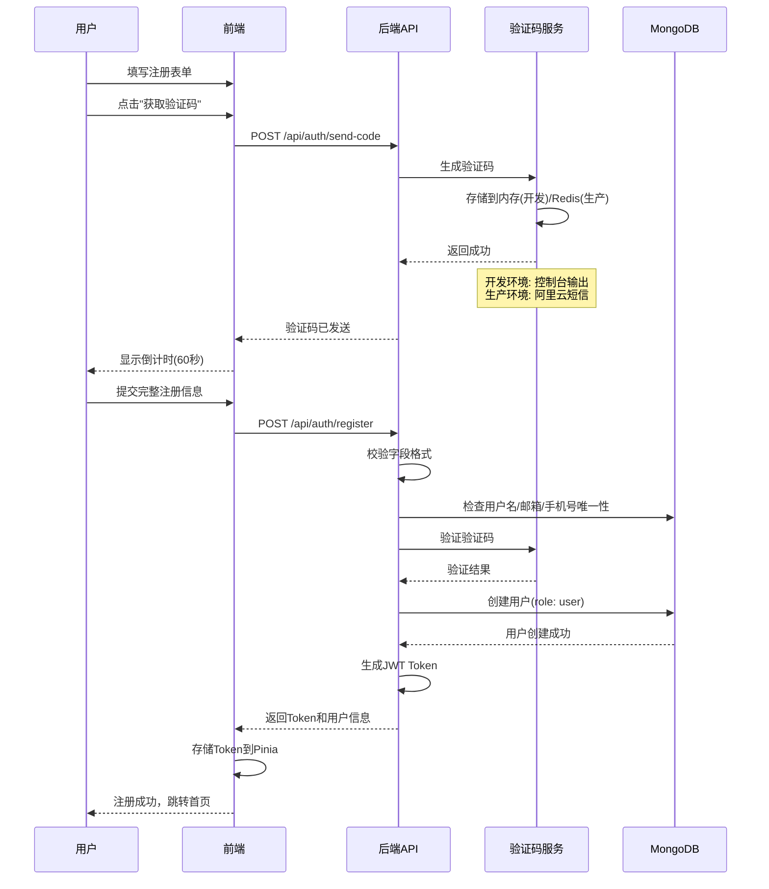
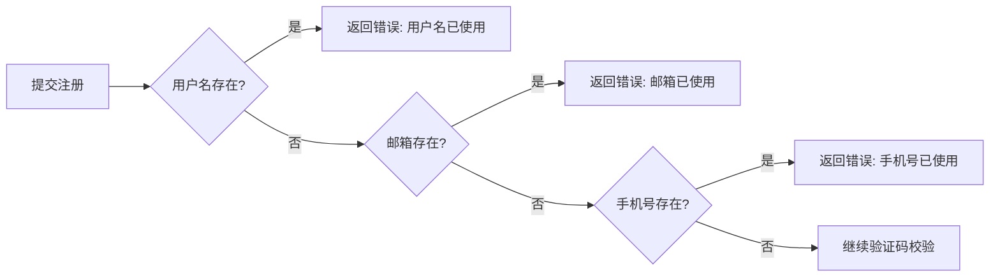
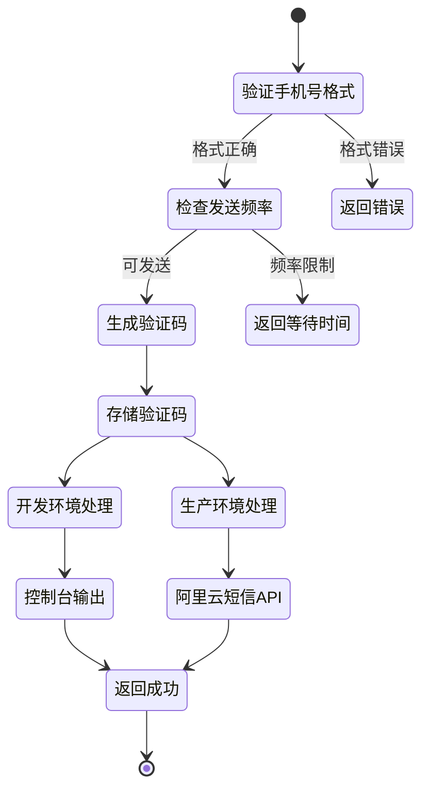
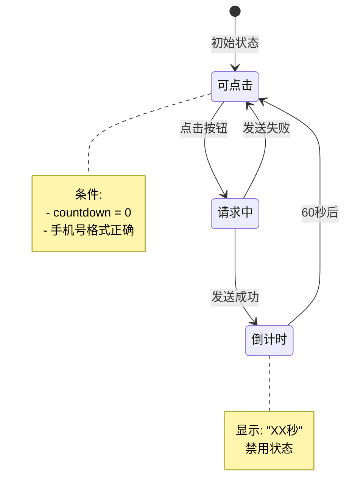
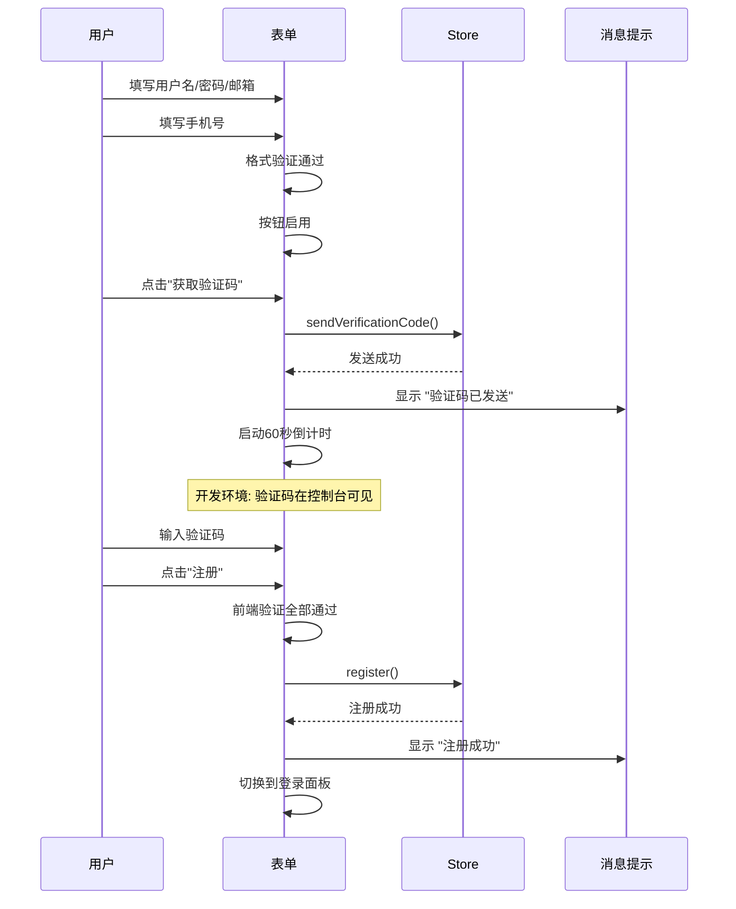
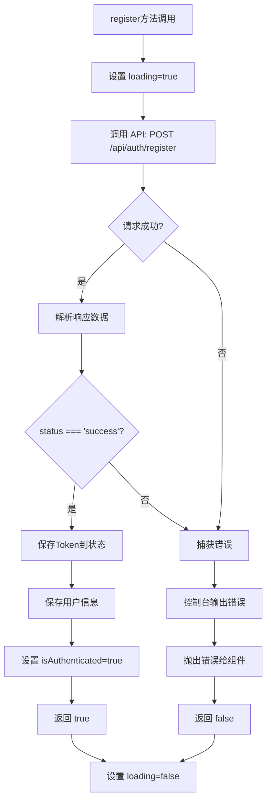
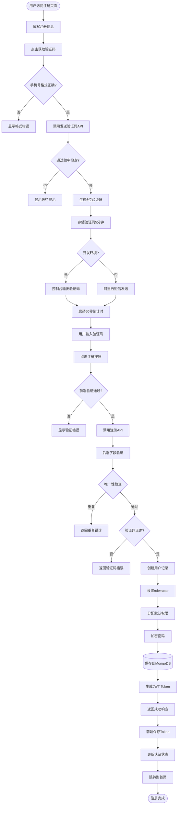

# 用户注册功能设计文档

## 1. 功能概览

### 1.1 业务背景

山东省思政课一体化中心平台当前存在用户注册功能不可用的问题。本设计旨在完善基于"手机号+验证码"的用户注册流程，使普通用户能够通过手机号自主注册账号并访问平台内容。

### 1.2 核心目标

- 实现手机号码+验证码的注册流程
- 在本地开发环境完成全流程验证
- 集成现有 RBAC 权限体系
- 为生产环境预留阿里云短信服务接口

### 1.3 用户角色定位

- **注册用户**：通过注册获得，角色为 `user`，拥有基础内容访问权限
- **管理员**：不通过注册获得，独立管理

### 1.4 核心流程图



## 2. 架构设计

### 2.1 技术栈对照

| 层级       | 技术组件             | 说明                                    |
| ---------- | -------------------- | --------------------------------------- |
| 前端表单   | Vue 3 + Element Plus | 使用 `AuthPage.vue` 组件                |
| 状态管理   | Pinia (useUserStore) | 管理用户认证状态                        |
| API调用    | Axios                | 基于 `/src/api/base.ts` 封装            |
| 后端路由   | Express Router       | `/server/routes/auth.js`                |
| 控制器     | authController       | `/server/controllers/authController.js` |
| 验证码服务 | VerificationService  | 单例模式，内存/Redis双模式              |
| 数据模型   | Mongoose (User)      | `/server/models/User.js`                |
| 安全防护   | express-rate-limit   | 频率限制中间件                          |

### 2.2 数据流架构

```mermaid
graph TD
    A[AuthPage.vue] -->|用户交互| B[useUserStore]
    B -->|API调用| C[/api/auth/*]
    C -->|请求路由| D[authController]
    D -->|验证码操作| E[verificationService]
    D -->|用户操作| F[(MongoDB - User)]
    E -->|开发环境| G[内存Map存储]
    E -->|生产环境| H[Redis缓存]
    D -->|返回JWT| C
    C -->|更新状态| B
    B -->|响应UI| A
```

## 3. API 端点设计

### 3.1 发送验证码

**端点定义**

- **路径**: `POST /api/auth/send-code`
- **访问级别**: 公开
- **频率限制**: 每IP 20次/5分钟
- **同手机号限制**: 60秒内仅可发送一次

**请求格式**

| 字段  | 类型   | 必填 | 说明                                     |
| ----- | ------ | ---- | ---------------------------------------- |
| phone | String | 是   | 手机号，需符合中国大陆格式 `1[3-9]\d{9}` |

**响应格式**

成功响应（HTTP 200）:
| 字段 | 类型 | 说明 |
|------|------|------|
| status | String | 固定值 "success" |
| message | String | "验证码已发送，请注意查收短信" |
| code | String | 仅开发环境返回，便于测试 |

失败响应示例:
| HTTP状态码 | 场景 | message |
|-----------|------|---------|
| 400 | 手机号格式错误 | "手机号格式不正确" |
| 429 | 频率限制触发 | "请等待 XX 秒后重试" |

**业务规则**

- 验证码为6位随机数字
- 有效期：5分钟
- 同一手机号：60秒内只能发送一次
- 开发环境：验证码输出到控制台
- 生产环境：调用阿里云短信服务

### 3.2 用户注册

**端点定义**

- **路径**: `POST /api/auth/register`
- **访问级别**: 公开
- **频率限制**: 每IP 20次/5分钟

**请求格式**

| 字段             | 类型   | 必填 | 验证规则                   |
| ---------------- | ------ | ---- | -------------------------- |
| username         | String | 是   | 4-16位字符，唯一性校验     |
| password         | String | 是   | 最少6位                    |
| fullName         | String | 是   | 真实姓名，最多50字符       |
| email            | String | 是   | 有效邮箱格式，唯一性校验   |
| phone            | String | 是   | 中国大陆手机号，唯一性校验 |
| verificationCode | String | 是   | 6位数字                    |

**响应格式**

成功响应（HTTP 201）:
| 字段 | 类型 | 说明 |
|------|------|------|
| status | String | "success" |
| message | String | "登录成功" |
| token | String | JWT认证令牌 |
| data.user | Object | 用户信息对象 |

用户信息字段:
| 字段 | 类型 | 说明 |
|------|------|------|
| id | String | 用户ID |
| username | String | 用户名 |
| name | String | 真实姓名 |
| email | String | 邮箱 |
| phone | String | 手机号 |
| role | String | 固定值 "user" |
| permissions | Array | 默认权限列表 |
| avatar | String | 头像URL（可为空） |

失败响应示例:
| HTTP状态码 | 场景 | message |
|-----------|------|---------|
| 400 | 必填字段缺失 | "用户名、密码、邮箱和手机号为必填项" |
| 400 | 用户名已存在 | "用户名已被使用" |
| 400 | 邮箱已存在 | "邮箱已被使用" |
| 400 | 手机号已存在 | "手机号已被使用" |
| 400 | 验证码错误 | "验证码不正确或已过期" |

## 4. 数据模型

### 4.1 User 模型扩展说明

基于现有 `/server/models/User.js`，注册功能涉及以下字段：

| 字段        | 数据类型      | 约束                         | 默认值     | 说明                  |
| ----------- | ------------- | ---------------------------- | ---------- | --------------------- |
| username    | String        | 必填，唯一，3-20字符         | -          | 用户名                |
| password    | String        | 必填，最少6字符，不查询返回  | -          | 密码（加密存储）      |
| name        | String        | 可选                         | -          | 真实姓名，注册时设置  |
| email       | String        | 可选，邮箱格式，稀疏唯一索引 | -          | 邮箱地址              |
| phone       | String        | 可选                         | -          | 手机号                |
| role        | String        | 枚举限定                     | "user"     | 注册用户固定为 "user" |
| status      | String        | 枚举: active/inactive/banned | "active"   | 账户状态              |
| active      | Boolean       | -                            | true       | 是否激活              |
| permissions | Array<String> | -                            | 见下方说明 | 权限列表              |
| createdAt   | Date          | 自动生成                     | -          | 创建时间              |
| updatedAt   | Date          | 自动生成                     | -          | 更新时间              |

**注册用户默认权限** (role="user" 时自动分配):

```
["news:read", "resources:read", "activities:read"]
```

### 4.2 密码加密机制

基于现有实现，使用 `bcryptjs`:

- 保存前自动触发 `pre('save')` 钩子
- 使用 `bcrypt.genSalt(10)` 生成盐值
- 使用 `bcrypt.hash()` 加密密码
- 查询时默认排除密码字段 (`select: false`)

### 4.3 数据唯一性校验策略



**校验实现**:

- 使用 MongoDB 查询 `User.findOne({ field })`
- 分别校验 `username`、`email`、`phone` 三个字段
- 任一字段重复则立即返回错误，避免信息泄露

## 5. 验证码服务设计

### 5.1 服务架构

**类定义**: `VerificationService` (单例模式)  
**文件位置**: `/server/services/verificationService.js`

**核心参数配置**:
| 参数 | 开发环境值 | 生产环境值 | 说明 |
|------|----------|-----------|------|
| 存储方式 | 内存 Map | Redis | 验证码存储介质 |
| 过期时间 | 5分钟 | 5分钟 | 验证码有效期 |
| 发送间隔 | 60秒 | 60秒 | 同手机号再次发送限制 |
| 验证码长度 | 6位数字 | 6位数字 | 验证码格式 |

### 5.2 核心方法设计

#### 5.2.1 发送验证码流程



**方法签名**: `async sendVerificationCode(phone)`

**内部逻辑**:

1. 手机号格式验证: `/^1[3-9]\d{9}$/`
2. 频率检查: `canSendCode(phone)` → 检查 Map 中 `lastSent` 时间戳
3. 生成验证码: `Math.random().toString().slice(-6).padStart(6, '0')`
4. 存储到 Map: `{ code, expires: Date.now() + 5*60*1000, lastSent: Date.now() }`
5. 发送行为:
   - **开发**: `console.log()` 输出验证码
   - **生产**: 调用阿里云短信SDK（预留接口）

#### 5.2.2 验证验证码流程

**方法签名**: `verifyCode(phone, inputCode)`

**验证逻辑表**:
| 检查项 | 条件 | 结果 |
|--------|------|------|
| 记录存在 | Map.has(phone) | 不存在 → false |
| 未过期 | now < record.expires | 已过期 → 删除记录 → false |
| 验证码匹配 | inputCode === record.code | 不匹配 → false |
| 全部通过 | - | 删除记录 → true |

**安全设计**:

- 验证成功后立即删除记录，防止验证码重用
- 记录验证失败日志（含掩码手机号）
- 不区分"验证码错误"和"验证码不存在"的错误提示，防止枚举攻击

#### 5.2.3 定期清理机制

**清理策略**:

- 定时器: 每10分钟执行一次
- 遍历 Map，删除 `expires < Date.now()` 的记录
- 记录清理数量到日志

### 5.3 阿里云短信集成预留接口

**集成位置**: `mockSendSMS()` 方法内

**预期改造**:

```
表格: 阿里云短信服务配置参数

| 配置项 | 环境变量名 | 说明 |
|--------|-----------|------|
| AccessKey ID | ALI_SMS_ACCESS_KEY_ID | 阿里云账号密钥 |
| AccessKey Secret | ALI_SMS_ACCESS_KEY_SECRET | 阿里云账号密钥 |
| 签名名称 | ALI_SMS_SIGN_NAME | 短信签名，如"思政课中心" |
| 模板代码 | ALI_SMS_TEMPLATE_CODE | 短信模板ID |
| SDK依赖 | @alicloud/dysmsapi20170525 | 阿里云短信SDK |
```

**短信模板示例**:

```
【思政课中心】您的验证码是：${code}，5分钟内有效。请勿泄露给他人。
```

## 6. 前端交互设计

### 6.1 组件结构

**主组件**: `/src/views/auth/AuthPage.vue`

**UI元素表**:
| 元素 | 组件类型 | 字段绑定 | 验证规则 |
|------|---------|---------|---------|
| 用户名输入 | el-input | registerForm.username | 必填，4-16位 |
| 密码输入 | el-input (password) | registerForm.password | 必填，8-20位 |
| 确认密码 | el-input (password) | registerForm.confirmPassword | 必填，与密码一致 |
| 邮箱输入 | el-input | registerForm.email | 必填，邮箱格式 |
| 手机号输入 | el-input | registerForm.phone | 必填，手机号格式 |
| 获取验证码按钮 | el-button (append) | - | 禁用条件见下 |
| 验证码输入 | el-input | registerForm.verificationCode | 必填，6位数字 |
| 注册按钮 | el-button | - | 提交表单 |

### 6.2 获取验证码按钮状态机



**按钮禁用条件**:

- `countdown > 0` (倒计时未结束)
- `!isPhoneValid` (手机号格式不正确)
- `sendingCode` (正在发送请求中)

**按钮文案切换**:

- 默认: "获取验证码"
- 倒计时: "60秒" → "59秒" → ... → "1秒"
- 加载中: 按钮 `loading` 属性为 `true`

### 6.3 表单验证时机

| 验证类型   | 触发时机             | 规则                   |
| ---------- | -------------------- | ---------------------- |
| 格式验证   | blur 事件            | Element Plus FormRules |
| 密码一致性 | confirmPassword blur | 自定义 validator       |
| 唯一性验证 | 后端校验             | 提交时由后端返回错误   |
| 验证码校验 | 提交时               | 后端验证码服务校验     |

### 6.4 注册流程用户体验



### 6.5 错误处理

**错误消息展示策略**:
| 错误来源 | 展示方式 | 示例消息 |
|---------|---------|---------|
| 前端验证 | el-form-item error | "用户名长度为4-16位字符" |
| 后端业务错误 | ElMessage.error | "用户名已被使用" |
| 网络错误 | ElMessage.error | "网络错误，请重试" |
| 验证码错误 | ElMessage.error | "验证码不正确或已过期" |

## 7. 状态管理设计

### 7.1 Pinia Store 方法

**Store**: `useUserStore` (`/src/stores/user.ts`)

**注册相关方法**:
| 方法名 | 参数 | 返回值 | 说明 |
|--------|------|--------|------|
| sendVerificationCode | phone: string | Promise<boolean> | 发送验证码 |
| register | RegisterPayload | Promise<boolean> | 用户注册 |
| login | LoginPayload | Promise<boolean> | 自动登录（注册成功后） |

**RegisterPayload 接口**:
| 字段 | 类型 | 必填 |
|------|------|------|
| username | string | 是 |
| password | string | 是 |
| email | string | 是 |
| phone | string | 是 |
| verificationCode | string | 是 |

### 7.2 注册方法实现逻辑



**Token 存储策略**:

- 保存到 Pinia 状态: `token.value = response.token`
- 持久化到 localStorage: 通过 Pinia persist 插件自动处理
- 设置 Axios 默认请求头: `Authorization: Bearer ${token}`

## 8. 安全策略

### 8.1 频率限制

**中间件**: `express-rate-limit` (`/server/middleware/rateLimit.js`)

**限制规则表**:
| API路径 | 时间窗口 | 最大请求数 | 限制粒度 |
|---------|---------|-----------|---------|
| /api/auth/send-code | 5分钟 | 20次 | 每IP |
| /api/auth/register | 5分钟 | 20次 | 每IP |
| 全局默认 | 1分钟 | 200次 | 每IP |

**超限响应**:

```
表格: Rate Limit 响应格式

| 字段 | 值 | 说明 |
|------|-----|------|
| HTTP状态码 | 429 | Too Many Requests |
| status | "error" | 错误标识 |
| message | "请求过于频繁，请稍后再试" | 错误消息 |
| code | "TOO_MANY_REQUESTS" | 错误代码 |
```

### 8.2 验证码防刷机制

**多层防护**:

1. **前端层**: 60秒倒计时，按钮禁用
2. **后端API层**: express-rate-limit 限制每IP 20次/5分钟
3. **服务层**: verificationService 限制同手机号60秒/次
4. **验证层**: 验证码使用后立即失效

### 8.3 密码安全

**加密策略**:

- 算法: bcrypt
- 盐值轮次: 10 rounds
- 存储: 仅存储加密后的哈希值
- 传输: HTTPS加密（生产环境）

**密码规则**:

- 最少长度: 6位（后端强制）
- 前端推荐: 8-20位（提升安全性）

### 8.4 输入验证

**验证层次表**:
| 验证层 | 验证内容 | 工具/方法 |
|--------|---------|----------|
| 前端 | 格式、长度、必填 | Element Plus FormRules |
| 后端路由 | 请求体结构 | validation.js (Joi) |
| 控制器 | 业务规则、唯一性 | 自定义验证逻辑 |
| 模型层 | 数据约束、类型 | Mongoose Schema |

**Joi 验证规则** (已存在于 `/server/middleware/validation.js`):
| 字段 | 规则 |
|------|------|
| username | required, trim, 3-20字符 |
| password | required, 6-50字符 |
| email | required, 邮箱格式 |
| phone | 可选, 手机号正则 `/^1[3-9]\d{9}$/` |
| fullName | required, trim, 最多50字符 |

### 8.5 防重放攻击

**验证码一次性使用**:

- 验证成功后立即从存储中删除
- 即使在有效期内也无法重复使用
- 防止验证码被截获后多次使用

### 8.6 信息泄露防护

**错误消息模糊化**:

- 验证码错误: 统一返回 "验证码不正确或已过期"
  - 不区分"不存在"、"已过期"、"错误"
- 用户存在性检查: 分别返回具体字段错误
  - 权衡: 用户体验 vs. 信息安全
  - 决策: 注册场景允许明确提示，避免用户困惑

**日志脱敏**:

- 手机号: 显示为 `138****5678`
- 验证码: 生产环境不记录到日志
- 密码: 永不记录明文

## 9. 测试策略

### 9.1 单元测试

**测试框架**: Vitest

**测试覆盖范围**:
| 测试对象 | 测试文件位置 | 测试要点 |
|---------|------------|---------|
| verificationService | server/services/verificationService.test.js | 验证码生成、验证、过期、频率限制 |
| User Model | server/models/User.test.js | 密码加密、验证方法、权限分配 |
| authController.register | server/controllers/authController.test.js | 字段验证、唯一性检查、Token生成 |

**核心测试用例**:

```
表格: 验证码服务测试用例

| 用例ID | 场景 | 输入 | 预期输出 |
|--------|------|------|---------|
| VC-001 | 生成验证码 | 无 | 返回6位数字字符串 |
| VC-002 | 验证正确验证码 | phone, 正确code | true |
| VC-003 | 验证错误验证码 | phone, 错误code | false |
| VC-004 | 验证过期验证码 | 超过5分钟的code | false (且记录被删除) |
| VC-005 | 频率限制-允许 | 首次发送 | 成功 |
| VC-006 | 频率限制-拒绝 | 60秒内再次发送 | 返回剩余等待时间 |
```

```
表格: 注册接口测试用例

| 用例ID | 场景 | 输入数据 | 预期HTTP状态 | 预期响应 |
|--------|------|---------|-------------|---------|
| REG-001 | 正常注册 | 完整有效数据 | 201 | 返回Token和用户信息 |
| REG-002 | 用户名已存在 | 重复username | 400 | "用户名已被使用" |
| REG-003 | 邮箱已存在 | 重复email | 400 | "邮箱已被使用" |
| REG-004 | 手机号已存在 | 重复phone | 400 | "手机号已被使用" |
| REG-005 | 验证码错误 | 错误code | 400 | "验证码不正确或已过期" |
| REG-006 | 验证码过期 | 过期code | 400 | "验证码不正确或已过期" |
| REG-007 | 缺少必填字段 | 缺少username | 400 | "用户名、密码、邮箱和手机号为必填项" |
| REG-008 | 密码过短 | password长度<6 | 400 | "密码长度不能少于6位" |
```

### 9.2 集成测试

**测试框架**: Playwright (E2E)

**测试场景**:
| 场景ID | 测试步骤 | 验证点 |
|--------|---------|--------|
| E2E-001 | 完整注册流程 | 1. 访问 /auth<br>2. 切换到注册标签<br>3. 填写表单<br>4. 获取验证码<br>5. 提交注册<br>6. 验证跳转到首页 |
| E2E-002 | 验证码倒计时 | 1. 点击获取验证码<br>2. 验证按钮禁用<br>3. 验证倒计时显示<br>4. 等待60秒后按钮恢复 |
| E2E-003 | 表单验证提示 | 1. 提交空表单<br>2. 验证错误提示显示<br>3. 填写格式错误数据<br>4. 验证格式错误提示 |

### 9.3 手动测试清单

**开发环境验证**:

```
表格: 开发环境测试检查项

| 检查项 | 验证步骤 | 预期结果 |
|--------|---------|---------|
| 验证码生成 | 点击获取验证码 | 控制台输出6位验证码 |
| 验证码验证 | 输入控制台验证码并提交 | 注册成功 |
| 频率限制 | 连续点击获取验证码 | 60秒内禁用 |
| 唯一性校验 | 使用已存在的用户名注册 | 提示"用户名已被使用" |
| 自动登录 | 注册成功后 | 自动跳转首页且已登录 |
| Token持久化 | 刷新页面 | 登录状态保持 |
| 权限验证 | 查看用户信息 | permissions包含基础读权限 |
```

## 10. 开发环境配置

### 10.1 环境变量

**前端配置** (`.env.development`):

```
表格: 前端环境变量

| 变量名 | 值 | 说明 |
|--------|-----|------|
| VITE_API_BASE_URL | http://localhost:3000/api | 后端API基础路径 |
```

**后端配置** (`server/.env`):

```
表格: 后端环境变量

| 变量名 | 开发环境值 | 必填 | 说明 |
|--------|-----------|------|------|
| NODE_ENV | development | 是 | 环境标识 |
| PORT | 3000 | 是 | 服务端口 |
| MONGODB_URI | mongodb://localhost:27017/sdszk | 是 | 数据库连接 |
| JWT_SECRET | (自定义密钥) | 是 | JWT签名密钥 |
| JWT_EXPIRES_IN | 1d | 否 | Token过期时间 |
| REDIS_HOST | localhost | 否 | Redis地址（可选） |
| REDIS_PORT | 6379 | 否 | Redis端口（可选） |
```

### 10.2 启动命令

**开发环境启动**:

```
表格: 启动命令

| 操作 | 命令 | 说明 |
|------|------|------|
| 一键启动 | ./scripts/development/dev-start.sh | 启动前后端+数据库 |
| 仅启动后端 | npm run server:dev | 运行在 :3000 |
| 仅启动前端 | npm run dev | 运行在 :5173 |
| 停止所有 | ./scripts/development/dev-stop.sh | 优雅停止 |
```

### 10.3 验证码调试

**开发环境调试方法**:

1. 打开浏览器控制台 (Console 面板)
2. 填写手机号，点击"获取验证码"
3. 控制台输出格式:
   ```
   🔐 验证码发送到 138****5678: 123456
   ```
4. 将验证码复制到注册表单
5. 提交注册

**生产环境切换**:

- 修改 `NODE_ENV=production`
- 配置阿里云短信服务环境变量
- 验证码将通过短信发送，不再输出到控制台

## 11. 部署考虑

### 11.1 生产环境差异

**环境对比表**:
| 配置项 | 开发环境 | 生产环境 |
|--------|---------|---------|
| 验证码发送 | 控制台输出 | 阿里云短信 |
| 验证码存储 | 内存Map | Redis |
| HTTPS | 非必需 | 必须启用 |
| JWT Secret | 简单字符串 | 高强度随机密钥 |
| Cookie Secure | false | true |
| 日志级别 | debug | info/warn |

### 11.2 生产部署清单

**部署前检查**:

```
表格: 生产部署检查项

| 检查项 | 验证方法 | 状态 |
|--------|---------|------|
| 阿里云短信服务已配置 | 环境变量存在且有效 | □ |
| Redis服务已启动 | redis-cli ping 返回 PONG | □ |
| HTTPS证书有效 | 访问生产域名验证锁图标 | □ |
| JWT_SECRET已更新 | 使用强随机密钥 | □ |
| MongoDB生产库已备份 | 执行备份脚本 | □ |
| 频率限制规则已确认 | 测试API限流 | □ |
| 日志监控已配置 | 检查日志输出 | □ |
```

### 11.3 Redis迁移

**迁移步骤**:

1. 修改 `verificationService.js`:
   - 添加 Redis 客户端初始化
   - 替换 Map 操作为 Redis 命令
2. Redis 命令映射:
   | 操作 | 当前(Map) | 迁移后(Redis) |
   |------|----------|--------------|
   | 存储验证码 | Map.set(phone, data) | SETEX verification:{phone} 300 code |
   | 获取验证码 | Map.get(phone) | GET verification:{phone} |
   | 删除验证码 | Map.delete(phone) | DEL verification:{phone} |
   | 检查存在 | Map.has(phone) | EXISTS verification:{phone} |
3. 配置环境变量: `REDIS_HOST`, `REDIS_PORT`
4. 测试验证码流程

### 11.4 监控指标

**建议监控指标**:

```
表格: 监控指标

| 指标名称 | 监控方式 | 告警阈值 |
|---------|---------|---------|
| 注册成功率 | 日志统计 | <90% |
| 验证码发送失败率 | 短信服务回调 | >5% |
| API响应时间 | APM工具 | >2秒 |
| 429错误数量 | 错误日志 | 突增 |
| 验证码验证失败率 | 日志统计 | >50% (可能攻击) |
```

## 12. 业务流程总结

### 12.1 完整注册流程图



### 12.2 关键决策点

```
表格: 核心设计决策

| 决策点 | 选项A | 选项B | 最终选择 | 理由 |
|--------|-------|-------|---------|------|
| 验证码存储 | 内存Map | Redis | 开发用Map，生产用Redis | 兼顾开发便利性和生产扩展性 |
| 验证码长度 | 4位 | 6位 | 6位 | 安全性与用户体验平衡 |
| 短信服务 | 模拟 | 真实集成 | 开发模拟，生产集成 | 降低开发成本 |
| 注册后行为 | 手动登录 | 自动登录 | 自动登录 | 提升用户体验 |
| 默认角色 | editor | user | user | 最小权限原则 |
| 密码最小长度 | 6位 | 8位 | 后端6位，前端建议8位 | 兼容旧数据，引导高安全 |
| 错误提示粒度 | 模糊 | 明确 | 注册场景明确 | 用户体验优先 |
```

## 13. 接口对接清单

### 13.1 后端接口开发任务

```
表格: 后端开发任务

| 任务ID | 模块 | 任务描述 | 文件位置 | 状态 |
|--------|------|---------|---------|------|
| BE-001 | 验证码服务 | 完善验证码服务的Redis支持 | server/services/verificationService.js | 待开发 |
| BE-002 | 认证控制器 | 完善register方法的验证码校验 | server/controllers/authController.js | 待完善 |
| BE-003 | 认证控制器 | 完善sendVerificationCode方法 | server/controllers/authController.js | 待完善 |
| BE-004 | User模型 | 确认fullName字段支持 | server/models/User.js | 待确认 |
| BE-005 | 路由配置 | 确认路由已正确配置 | server/routes/auth.js | 已完成 |
| BE-006 | 频率限制 | 确认rate limit规则 | server/middleware/rateLimit.js | 已完成 |
```

### 13.2 前端开发任务

```
表格: 前端开发任务

| 任务ID | 模块 | 任务描述 | 文件位置 | 状态 |
|--------|------|---------|---------|------|
| FE-001 | 注册组件 | 添加fullName字段到表单 | src/views/auth/AuthPage.vue | 待开发 |
| FE-002 | 注册组件 | 完善表单验证规则 | src/views/auth/AuthPage.vue | 待完善 |
| FE-003 | User Store | 完善register方法 | src/stores/user.ts | 待完善 |
| FE-004 | User Store | 完善sendVerificationCode方法 | src/stores/user.ts | 待完善 |
| FE-005 | API模块 | 添加注册相关API类型定义 | src/api/modules/user.ts | 待开发 |
| FE-006 | 错误处理 | 优化错误消息展示 | src/views/auth/AuthPage.vue | 待完善 |
```

### 13.3 集成测试任务

```
表格: 测试任务

| 任务ID | 测试类型 | 测试范围 | 负责人 | 状态 |
|--------|---------|---------|--------|------|
| TEST-001 | 单元测试 | verificationService | 后端开发 | 待编写 |
| TEST-002 | 单元测试 | authController.register | 后端开发 | 待编写 |
| TEST-003 | API测试 | 注册流程完整性 | 后端开发 | 待测试 |
| TEST-004 | E2E测试 | 前端注册流程 | 前端开发 | 待编写 |
| TEST-005 | 手动测试 | 开发环境完整流程 | QA/开发 | 待执行 |
```

## 14. 代码实现指导

### 14.1 后端代码修改清单

#### 14.1.1 authController.js 修改

**文件路径**: `server/controllers/authController.js`

**修改1: 导入验证码服务**
在文件顶部添加导入：

```
位置: 第10行之后
添加: import verificationService from "../services/verificationService.js";
```

**修改2: 完善 register 方法**

定位到 `export const register` 方法（约第360行），修改以下部分：

**必填字段验证**（约第380行）：

```
原代码:
if (!username || !password || !email) {
  return next(new BadRequestError("用户名、密码和邮箱为必填项"));
}

修改为:
const { username, email, phone, password, verificationCode, fullName } = req.body;

if (!username || !password || !email || !phone || !fullName) {
  return next(new BadRequestError("用户名、密码、邮箱、手机号和真实姓名为必填项"));
}
```

**手机号验证改为必填**（约第395行）：

```
原代码:
if (phone) {
  const phoneRegex = /^1[3-9]\d{9}$/;
  if (!phoneRegex.test(phone)) {
    return next(new BadRequestError("手机号格式不正确"));
  }
}

修改为:
const phoneRegex = /^1[3-9]\d{9}$/;
if (!phoneRegex.test(phone)) {
  return next(new BadRequestError("手机号格式不正确"));
}
```

**添加真实姓名验证**（约第400行，新增）：

```
if (fullName.length > 50) {
  return next(new BadRequestError("真实姓名不能超过50个字符"));
}
```

**手机号唯一性检查改为必填**（约第415行）：

```
原代码:
if (phone) {
  const existingPhone = await User.findOne({ phone });
  if (existingPhone) {
    return next(new BadRequestError("手机号已被使用"));
  }
}

修改为:
const existingPhone = await User.findOne({ phone });
if (existingPhone) {
  return next(new BadRequestError("手机号已被使用"));
}
```

**添加验证码校验**（约第422行）：

```
原代码:
// TODO: 验证手机验证码
// 暂时跳过验证码验证，直接创建用户

修改为:
if (!verificationCode) {
  return next(new BadRequestError("请提供验证码"));
}

const isCodeValid = verificationService.verifyCode(phone, verificationCode);
if (!isCodeValid) {
  return next(new BadRequestError("验证码不正确或已过期"));
}
```

**创建用户时添加 name 字段**（约第428行）：

```
原代码:
const newUser = await User.create({
  username,
  email,
  phone,
  password,
  role: "user",
  status: "active",
  active: true,
});

修改为:
const newUser = await User.create({
  username,
  email,
  phone,
  password,
  name: fullName,
  role: "user",
  status: "active",
  active: true,
});
```

**修改3: 完善 sendVerificationCode 方法**

定位到 `export const sendVerificationCode` 方法（约第473行），整体替换为：

```
export const sendVerificationCode = async (req, res, next) => {
  try {
    const { phone } = req.body;

    authLogger.debug(
      {
        phone: phone
          ? phone.substring(0, 3) + "****" + phone.substring(7)
          : undefined,
      },
      "发送验证码请求",
    );

    if (!phone) {
      return next(new BadRequestError("请提供手机号"));
    }

    const result = await verificationService.sendVerificationCode(phone);

    if (!result.success) {
      return next(new BadRequestError(result.message));
    }

    authLogger.info(
      {
        phone: phone.substring(0, 3) + "****" + phone.substring(7),
      },
      "验证码发送成功",
    );

    const response = {
      status: "success",
      message: result.message || "验证码已发送，请注意查收短信",
    };

    if (process.env.NODE_ENV === "development" && result.code) {
      response.code = result.code;
    }

    res.status(200).json(response);
  } catch (error) {
    logError(error, {
      context: "send_verification_code",
      phone: req.body.phone
        ? req.body.phone.substring(0, 3) + "****" + req.body.phone.substring(7)
        : undefined,
      ip: req.ip,
    });

    next(error);
  }
};
```

#### 14.1.2 User.js 模型验证

**文件路径**: `server/models/User.js`

确认以下字段已存在（无需修改）：

- `username`: 已存在，3-20字符
- `password`: 已存在，最少6字符
- `name`: 已存在，用于存储真实姓名
- `email`: 已存在，邮箱格式验证
- `phone`: 已存在，字符串类型
- `role`: 已存在，默认值需确认

**可能需要的修改**（如果 role 默认值不是 "user"）：

```
位置: 约第34行
原代码:
role: {
  type: String,
  enum: ["admin", "editor", "user", "co_admin", "sys_admin", "users"],
  default: "editor",
},

如需修改为:
role: {
  type: String,
  enum: ["admin", "editor", "user", "co_admin", "sys_admin", "users"],
  default: "user",  // 改为user
},
```

**注意**: 由于代码中使用 `role: "user"` 显式指定，这个修改不是必须的。

#### 14.1.3 验证码服务验证

**文件路径**: `server/services/verificationService.js`

该文件已完整实现，无需修改。确认包含以下方法：

- `generateCode()`: 生成6位验证码
- `sendVerificationCode(phone)`: 发送验证码
- `verifyCode(phone, inputCode)`: 验证验证码
- `canSendCode(phone)`: 检查发送频率
- `cleanupExpiredCodes()`: 清理过期验证码

### 14.2 前端代码修改清单

#### 14.2.1 AuthPage.vue 表单添加 fullName 字段

**文件路径**: `src/views/auth/AuthPage.vue`

**修改1: 表单数据添加 fullName**（约第175行）：

```
原代码:
const registerForm = ref({
  username: "",
  password: "",
  confirmPassword: "",
  email: "",
  phone: "",
  verificationCode: "",
});

修改为:
const registerForm = ref({
  username: "",
  password: "",
  confirmPassword: "",
  fullName: "",
  email: "",
  phone: "",
  verificationCode: "",
});
```

**修改2: 添加 fullName 表单项**（约第85行，在邮箱输入框之前）：

```
位置: <el-form-item prop="email"> 之前
添加:
<el-form-item prop="fullName">
  <el-input
    v-model="registerForm.fullName"
    :prefix-icon="User"
    placeholder="请输入真实姓名"
  />
</el-form-item>
```

**修改3: 添加 fullName 验证规则**（约第200行）：

```
位置: registerRules 对象中，email 规则之前
添加:
fullName: [
  { required: true, message: "请输入真实姓名", trigger: "blur" },
  { max: 50, message: "姓名长度不能超过50个字符", trigger: "blur" },
],
```

**修改4: 重置表单时包含 fullName**（约第240行）：

```
原代码:
registerForm.value = {
  username: "",
  password: "",
  confirmPassword: "",
  email: "",
  phone: "",
  verificationCode: "",
};

修改为:
registerForm.value = {
  username: "",
  password: "",
  confirmPassword: "",
  fullName: "",
  email: "",
  phone: "",
  verificationCode: "",
};
```

**修改5: 提交注册时包含 fullName**（约第285行）：

```
原代码:
const success = await userStore.register({
  username: registerForm.value.username,
  password: registerForm.value.password,
  email: registerForm.value.email,
  phone: registerForm.value.phone,
  verificationCode: registerForm.value.verificationCode,
});

修改为:
const success = await userStore.register({
  username: registerForm.value.username,
  password: registerForm.value.password,
  fullName: registerForm.value.fullName,
  email: registerForm.value.email,
  phone: registerForm.value.phone,
  verificationCode: registerForm.value.verificationCode,
});
```

#### 14.2.2 user.ts Store 添加 fullName 支持

**文件路径**: `src/stores/user.ts`

**修改1: RegisterPayload 接口添加 fullName**（约第45行）：

```
原代码:
interface RegisterPayload {
  username: string;
  password: string;
  email: string;
  phone: string;
  verificationCode: string;
}

修改为:
interface RegisterPayload {
  username: string;
  password: string;
  fullName: string;
  email: string;
  phone: string;
  verificationCode: string;
}
```

**修改2: sendVerificationCode 方法完善**（约第490行）：

确认该方法存在且实现正确：

```
async function sendVerificationCode(phone: string): Promise<boolean> {
  try {
    const response = await api.post('/auth/send-code', { phone });
    return response.data?.status === 'success';
  } catch (error) {
    console.error('发送验证码失败:', error);
    return false;
  }
}
```

如果不存在，需要添加此方法到 store 的 return 对象中。

### 14.3 测试验证步骤

#### 14.3.1 后端独立测试

使用 curl 或 Postman 测试：

**测试1: 发送验证码**

```bash
curl -X POST http://localhost:3000/api/auth/send-code \
  -H "Content-Type: application/json" \
  -d '{"phone": "13800138000"}'
```

预期响应：

```json
{
  "status": "success",
  "message": "验证码发送成功",
  "code": "123456" // 仅开发环境
}
```

同时控制台应输出：

```
🔐 验证码发送到 138****8000: 123456
```

**测试2: 注册用户**

```bash
curl -X POST http://localhost:3000/api/auth/register \
  -H "Content-Type: application/json" \
  -d '{
    "username": "testuser",
    "password": "test123456",
    "fullName": "测试用户",
    "email": "test@example.com",
    "phone": "13800138000",
    "verificationCode": "123456"
  }'
```

预期响应：

```json
{
  "status": "success",
  "message": "登录成功",
  "token": "eyJhbGciOiJIUzI1NiIs...",
  "data": {
    "user": {
      "id": "...",
      "username": "testuser",
      "name": "测试用户",
      "email": "test@example.com",
      "role": "user",
      "permissions": ["news:read", "resources:read", "activities:read"]
    }
  }
}
```

#### 14.3.2 前端完整流程测试

**步骤**：

1. 启动前端: `npm run dev`
2. 启动后端: `npm run server:dev`
3. 访问: `http://localhost:5173/auth`
4. 切换到"注册"标签
5. 填写表单：
   - 用户名: testuser2
   - 密码: test123456
   - 确认密码: test123456
   - 真实姓名: 张三
   - 邮箱: zhangsan@test.com
   - 手机号: 13900139000
6. 点击"获取验证码"
7. 检查浏览器控制台，复制验证码
8. 输入验证码
9. 点击"注册"
10. 验证：
    - 显示"注册成功"消息
    - 自动切换到登录面板
    - 或直接跳转到首页（如果实现了自动登录）

#### 14.3.3 错误场景测试

**场景1: 验证码错误**

- 输入错误的验证码
- 预期: 显示"验证码不正确或已过期"

**场景2: 用户名重复**

- 使用已存在的用户名注册
- 预期: 显示"用户名已被使用"

**场景3: 手机号重复**

- 使用已存在的手机号注册
- 预期: 显示"手机号已被使用"

**场景4: 验证码过期**

- 获取验证码后等待5分钟
- 再提交注册
- 预期: 显示"验证码不正确或已过期"

**场景5: 频率限制**

- 连续点击"获取验证码"
- 预期: 60秒内禁用，显示倒计时

### 14.4 常见问题排查

**问题1: 验证码没有输出到控制台**
解决方案:

- 检查 `NODE_ENV=development` 是否设置
- 检查后端控制台，而非浏览器控制台

**问题2: 提示"验证码不正确或已过期"**
解决方案:

- 确认复制的验证码正确（6位数字）
- 检查是否超过5分钟
- 重新获取验证码

**问题3: 注册后没有自动登录**
解决方案:

- 检查后端是否返回了 token
- 检查前端是否正确保存了 token 到 store
- 查看浏览器 localStorage 是否有 token

**问题4: 手机号格式验证失败**
解决方案:

- 确认手机号为11位
- 确认以1开头，第二位为3-9
- 示例正确格式: 13800138000

**问题5: fullName 字段保存失败**
解决方案:

- 检查 User 模型的 name 字段是否存在
- 检查后端日志中是否有验证错误
- 确认 fullName 长度不超过50字符

### 14.5 开发环境配置检查

**后端环境变量** (`server/.env`):

```bash
NODE_ENV=development
PORT=3000
MONGODB_URI=mongodb://localhost:27017/sdszk
JWT_SECRET=your-secret-key-here
JWT_EXPIRES_IN=1d
```

**前端环境变量** (`.env.development`):

```bash
VITE_API_BASE_URL=http://localhost:3000/api
```

**数据库连接检查**:

```bash
# 确认 MongoDB 运行
mongosh --eval "db.adminCommand('ping')"

# 或使用项目脚本
./scripts/development/dev-start.sh
```

## 15. 后续优化方向

### 14.1 功能增强

```
表格: 功能增强计划

| 功能 | 优先级 | 描述 | 预期收益 |
|------|-------|------|---------|
| 图形验证码 | 中 | 获取短信验证码前先验证图形验证码 | 防止机器人刷短信 |
| 密码强度提示 | 低 | 实时显示密码强度等级 | 提升账户安全性 |
| 邮箱验证 | 低 | 注册后发送邮箱验证链接 | 确保邮箱有效性 |
| 社交账号注册 | 低 | 支持微信/QQ快捷注册 | 降低注册门槛 |
| 用户协议确认 | 高 | 注册时勾选同意用户协议 | 法律合规 |
```

### 14.2 性能优化

```
表格: 性能优化方向

| 优化项 | 当前状态 | 优化方案 | 预期提升 |
|--------|---------|---------|---------|
| 验证码存储 | 内存Map | 迁移到Redis | 支持分布式部署 |
| 唯一性查询 | 顺序查询3次 | 单次聚合查询 | 减少50%数据库查询 |
| 密码加密 | 同步操作 | 异步+队列 | 提升响应速度 |
| 短信发送 | 同步等待 | 异步+消息队列 | 降低接口延迟 |
```

### 14.3 安全加固

```
表格: 安全加固措施

| 措施 | 当前状态 | 改进方案 | 风险降低 |
|------|---------|---------|---------|
| 密码策略 | 最少6位 | 强制复杂度（大小写+数字+符号） | 防暴力破解 |
| 设备指纹 | 无 | 记录设备信息 | 异常登录检测 |
| IP黑名单 | 无 | 恶意IP自动封禁 | 防刷注册 |
| 验证码复杂度 | 6位数字 | 数字+字母混合 | 提升破解难度 |
| 注册审核 | 自动通过 | 可选人工审核 | 防垃圾账号 |
```
