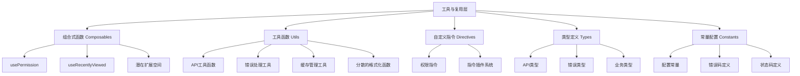

# Vue3项目工具与复用层架构技术文档

## 概述

本文档详细分析Vue3项目的第六层架构：**工具与复用层**。工具与复用层是前端应用的基础设施，提供可复用的业务逻辑、工具函数、自定义指令和类型定义。本项目虽然在这一层相对轻量，但展现了清晰的设计思路和扩展潜力，同时也揭示了可以进一步完善的空间。

## 技术栈

- **Vue 3 Composition API** - 组合式函数开发
- **TypeScript** - 类型定义和工具函数
- **Pinia** - 状态管理集成
- **自定义指令** - Vue指令系统
- **模块化设计** - ES6模块和依赖管理

## 1. 工具与复用层架构概览

### 1.1 层次结构分析



### 1.2 文件结构分析

```
src/
├── composables/              # 组合式函数 (轻量)
│   ├── usePermission.ts     # 权限管理Hook
│   └── useRecentlyViewed.ts # 最近访问Hook
├── utils/                   # 工具函数 (API专用)
│   ├── api.ts               # API实例配置
│   ├── apiCache.ts          # API缓存管理
│   ├── apiErrorHandler.ts   # API错误处理
│   └── interceptors.ts      # 请求拦截器
├── directives/              # 自定义指令
│   ├── index.ts             # 指令注册
│   └── permission.ts        # 权限指令
├── types/                   # 类型定义
│   ├── api.types.ts         # API类型
│   ├── error.types.ts       # 错误类型
│   ├── news.ts              # 新闻类型
│   └── resource.ts          # 资源类型
├── config/                  # 配置常量
│   └── index.ts             # 统一配置
└── services/                # 服务层 (业务逻辑)
    ├── base.service.ts      # 基础服务类
    └── *.service.ts         # 具体业务服务
```

## 2. 组合式函数 (Composables) 深度分析

### 2.1 权限管理 Composable

```typescript
// src/composables/usePermission.ts
import { computed } from "vue";
import { useUserStore } from "../stores/user";

export function usePermission() {
  const userStore = useUserStore();

  // 检查单个权限
  const hasPermission = (permission: string) => {
    return userStore.hasPermission(permission);
  };

  // 检查多个权限（全部满足）
  const hasAllPermissions = (permissions: string[]) => {
    return permissions.every((permission) =>
      userStore.hasPermission(permission)
    );
  };

  // 检查多个权限（满足其中之一）
  const hasAnyPermission = (permissions: string[]) => {
    return permissions.some((permission) =>
      userStore.hasPermission(permission)
    );
  };

  // 是否为管理员
  const isAdmin = computed(() => userStore.isAdmin);

  // 是否为编辑者
  const isEditor = computed(() => userStore.isEditor);

  return {
    hasPermission,
    hasAllPermissions,
    hasAnyPermission,
    isAdmin,
    isEditor,
  };
}
```

#### 权限Composable特点：

- **Store集成**: 与Pinia用户状态深度集成
- **逻辑复用**: 在多个组件中复用权限逻辑
- **类型安全**: 完整的TypeScript支持
- **响应式**: 基于computed的响应式权限状态
- **多种检查模式**: AND、OR逻辑的权限检查

#### 使用场景：

```vue
<script setup>
import { usePermission } from "@/composables/usePermission";

const { hasPermission, hasAllPermissions, isAdmin } = usePermission();

// 在模板中使用
const canEdit = hasPermission("news:edit");
const canManage = hasAllPermissions(["news:create", "news:delete"]);
</script>
```

### 2.2 最近访问记录 Composable

```typescript
// src/composables/useRecentlyViewed.ts
import { useStorage } from "@vueuse/core";
import type { Ref } from "vue";

interface HasId {
  id: string;
  [key: string]: any;
}

export function useRecentlyViewed<T extends HasId>(
  key: string,
  maxItems: number = 10
) {
  const items = useStorage<T[]>(key, []);

  const addItem = (item: T) => {
    const index = items.value.findIndex((existing) => existing.id === item.id);
    if (index > -1) {
      items.value.splice(index, 1);
    }
    items.value.unshift(item);
    if (items.value.length > maxItems) {
      items.value.pop();
    }
  };

  const removeItem = (id: string) => {
    const index = items.value.findIndex((item) => item.id === id);
    if (index > -1) {
      items.value.splice(index, 1);
    }
  };

  const clearItems = () => {
    items.value = [];
  };

  return {
    items,
    addItem,
    removeItem,
    clearItems,
  };
}
```

#### 最近访问Composable特点：

- **泛型设计**: 支持任意类型的数据结构
- **持久化存储**: 基于@vueuse/core的存储功能
- **LRU算法**: 最近最少使用的数据管理
- **类型约束**: 要求数据必须有id字段
- **灵活配置**: 可配置最大存储数量

#### 在Store中的应用：

```typescript
// 在news.ts store中使用
const { items: recentlyViewed, addItem: addToRecentlyViewed } =
  useRecentlyViewed<News>("recently-viewed-news");

// 在resource.ts store中使用
const { items: recentlyDownloaded, addItem: addToRecentlyDownloaded } =
  useRecentlyViewed<Resource>("recently-downloaded-resources");
```

### 2.3 Composable设计模式总结

```typescript
// 标准Composable模式
export function useCustomHook<T>(config?: HookConfig) {
  // 1. 响应式状态
  const state = ref<T>();
  const loading = ref(false);

  // 2. 计算属性
  const computedValue = computed(() => {
    // 计算逻辑
  });

  // 3. 方法定义
  const methods = {
    async fetchData() {
      loading.value = true;
      try {
        // 异步操作
      } finally {
        loading.value = false;
      }
    },
  };

  // 4. 生命周期
  onMounted(() => {
    // 初始化逻辑
  });

  onUnmounted(() => {
    // 清理逻辑
  });

  // 5. 返回接口
  return {
    state,
    loading,
    computedValue,
    ...methods,
  };
}
```

## 3. 自定义指令系统

### 3.1 权限指令实现

```typescript
// src/directives/permission.ts
import { type Directive, type DirectiveBinding } from "vue";
import { useUserStore } from "../stores/user";

type PermissionValue = string | string[];

export default {
  mounted(el: HTMLElement, binding: DirectiveBinding<PermissionValue>) {
    const userStore = useUserStore();
    const { value } = binding;

    if (typeof value === "string") {
      if (!userStore.hasPermission(value)) {
        el.parentNode?.removeChild(el);
      }
    } else if (Array.isArray(value)) {
      const hasPermission = value.some((permission) =>
        userStore.hasPermission(permission)
      );
      if (!hasPermission) {
        el.parentNode?.removeChild(el);
      }
    }
  },
} as Directive<HTMLElement, PermissionValue>;
```

#### 权限指令特点：

- **DOM级别控制**: 直接从DOM中移除无权限元素
- **类型安全**: 支持字符串和数组两种权限格式
- **OR逻辑**: 数组权限采用OR逻辑判断
- **生命周期**: 在mounted阶段执行权限检查
- **Store集成**: 与用户状态管理紧密集成

### 3.2 指令插件系统

```typescript
// src/directives/index.ts
import { App } from "vue";
import permissionDirective from "./permission";
import hasPermissionComponent from "../components/common/HasPermission.vue";

export default {
  install(app: App) {
    // 注册 v-permission 指令
    app.directive("permission", permissionDirective);

    // 注册 HasPermission 组件
    app.component("HasPermission", hasPermissionComponent);
  },
};
```

#### 插件系统特点：

- **统一注册**: 集中管理所有自定义指令
- **组件集成**: 同时注册相关组件
- **Vue插件标准**: 遵循Vue插件开发规范
- **扩展性**: 易于添加新的指令

#### 使用示例：

```vue
<template>
  <!-- 指令方式 -->
  <el-button v-permission="'news:create'">创建新闻</el-button>

  <!-- 组件方式 -->
  <HasPermission permission="news:create">
    <el-button>创建新闻</el-button>
  </HasPermission>
</template>
```

## 4. 工具函数分析

### 4.1 现有工具函数概况

当前项目的工具函数主要集中在API相关领域：

```typescript
// src/utils/ 目录结构
├── api.ts               # Axios实例配置
├── apiCache.ts          # API响应缓存
├── apiErrorHandler.ts   # 统一错误处理
└── interceptors.ts      # 请求/响应拦截器
```

### 4.2 分散的格式化函数问题

通过代码扫描发现，项目中存在大量重复的格式化函数：

```typescript
// 在多个组件中重复定义的格式化函数

// VideoPlayer.vue
const formatTime = (time: number): string => {
  const minutes = Math.floor(time / 60)
  const seconds = Math.floor(time % 60)
  return `${minutes.toString().padStart(2, '0')}:${seconds.toString().padStart(2, '0')}`
}

// NewsListItem.vue
const formatDateDay = (date: string) => {
  return new Date(date).toLocaleDateString('zh-CN', { day: '2-digit' })
}

// RelatedList.vue
formatDate(date: string | Date): string {
  return new Date(date).toLocaleDateString('zh-CN')
}
```

### 4.3 建议的工具函数重构

```typescript
// src/utils/format.ts (建议新增)
export class DateFormatter {
  /**
   * 格式化日期为中文本地化格式
   */
  static formatDate(date: string | Date): string {
    return new Date(date).toLocaleDateString("zh-CN", {
      year: "numeric",
      month: "2-digit",
      day: "2-digit",
    });
  }

  /**
   * 格式化日期为年月格式
   */
  static formatMonthYear(date: string | Date): string {
    return new Date(date).toLocaleDateString("zh-CN", {
      year: "numeric",
      month: "2-digit",
    });
  }

  /**
   * 格式化为相对时间
   */
  static formatRelativeTime(date: string | Date): string {
    const now = new Date();
    const target = new Date(date);
    const diff = now.getTime() - target.getTime();

    const minutes = Math.floor(diff / 60000);
    const hours = Math.floor(diff / 3600000);
    const days = Math.floor(diff / 86400000);

    if (minutes < 60) return `${minutes}分钟前`;
    if (hours < 24) return `${hours}小时前`;
    if (days < 30) return `${days}天前`;

    return DateFormatter.formatDate(date);
  }
}

export class TimeFormatter {
  /**
   * 格式化视频时间
   */
  static formatDuration(seconds: number): string {
    const minutes = Math.floor(seconds / 60);
    const remainingSeconds = Math.floor(seconds % 60);
    return `${minutes.toString().padStart(2, "0")}:${remainingSeconds.toString().padStart(2, "0")}`;
  }

  /**
   * 格式化为时分秒
   */
  static formatHMS(seconds: number): string {
    const hours = Math.floor(seconds / 3600);
    const minutes = Math.floor((seconds % 3600) / 60);
    const secs = Math.floor(seconds % 60);

    if (hours > 0) {
      return `${hours}:${minutes.toString().padStart(2, "0")}:${secs.toString().padStart(2, "0")}`;
    }
    return `${minutes}:${secs.toString().padStart(2, "0")}`;
  }
}

export class FileFormatter {
  /**
   * 格式化文件大小
   */
  static formatFileSize(bytes: number): string {
    if (bytes === 0) return "0 B";

    const k = 1024;
    const sizes = ["B", "KB", "MB", "GB", "TB"];
    const i = Math.floor(Math.log(bytes) / Math.log(k));

    return parseFloat((bytes / Math.pow(k, i)).toFixed(2)) + " " + sizes[i];
  }

  /**
   * 获取文件扩展名
   */
  static getFileExtension(filename: string): string {
    return filename.slice(((filename.lastIndexOf(".") - 1) >>> 0) + 2);
  }
}
```

### 4.4 数据验证工具函数

```typescript
// src/utils/validation.ts (建议新增)
export class Validator {
  /**
   * 验证邮箱格式
   */
  static isEmail(email: string): boolean {
    const emailRegex = /^[^\s@]+@[^\s@]+\.[^\s@]+$/;
    return emailRegex.test(email);
  }

  /**
   * 验证手机号格式
   */
  static isPhone(phone: string): boolean {
    const phoneRegex = /^1[3-9]\d{9}$/;
    return phoneRegex.test(phone);
  }

  /**
   * 验证URL格式
   */
  static isURL(url: string): boolean {
    try {
      new URL(url);
      return true;
    } catch {
      return false;
    }
  }

  /**
   * 验证密码强度
   */
  static isStrongPassword(password: string): {
    isValid: boolean;
    errors: string[];
  } {
    const errors: string[] = [];

    if (password.length < 8) {
      errors.push("密码长度至少8位");
    }

    if (!/[A-Z]/.test(password)) {
      errors.push("至少包含一个大写字母");
    }

    if (!/[a-z]/.test(password)) {
      errors.push("至少包含一个小写字母");
    }

    if (!/\d/.test(password)) {
      errors.push("至少包含一个数字");
    }

    return {
      isValid: errors.length === 0,
      errors,
    };
  }
}
```

## 5. 类型定义系统

### 5.1 现有类型定义分析

```typescript
// src/types/api.types.ts
export interface ApiErrorResponse {
  message: string;
  code: string;
  status: number;
  errors?: Record<string, string[]>;
  details?: unknown;
  timestamp?: string;
  path?: string;
}

export interface ErrorHandlerOptions {
  showNotification?: boolean;
  redirectOnAuth?: boolean;
  logError?: boolean;
}
```

### 5.2 业务类型定义

```typescript
// src/types/news.ts
export interface News {
  id: string;
  title: string;
  content: string;
  summary?: string;
  cover?: string;
  author?: string;
  category?: string;
  tags?: string[];
  publishDate?: string;
  status: "draft" | "published" | "archived";
  viewCount?: number;
  createdAt: string;
  updatedAt: string;
}

// src/types/resource.ts
export interface Resource {
  id: string;
  title: string;
  description?: string;
  fileUrl: string;
  fileSize: number;
  fileType: string;
  category?: string;
  tags?: string[];
  downloadCount?: number;
  createdAt: string;
  updatedAt: string;
}
```

### 5.3 工具类型定义

```typescript
// src/types/common.ts (建议新增)
// 基础实体接口
export interface BaseEntity {
  id: string;
  createdAt: string;
  updatedAt: string;
}

// 分页接口
export interface Pagination {
  total: number;
  page: number;
  limit: number;
  hasNext: boolean;
  hasPrev: boolean;
}

// 排序接口
export interface Sort {
  field: string;
  order: "asc" | "desc";
}

// 搜索接口
export interface SearchParams {
  keyword?: string;
  category?: string;
  tags?: string[];
  startDate?: string;
  endDate?: string;
  sort?: Sort;
  pagination?: Pick<Pagination, "page" | "limit">;
}

// 响应包装类型
export type ApiResult<T> =
  | {
      success: true;
      data: T;
      message?: string;
    }
  | {
      success: false;
      error: string;
      code?: string;
    };

// 工具类型
export type Optional<T, K extends keyof T> = Omit<T, K> & Partial<Pick<T, K>>;
export type RequiredBy<T, K extends keyof T> = T & Required<Pick<T, K>>;
export type PartialBy<T, K extends keyof T> = Omit<T, K> & Partial<Pick<T, K>>;

// 事件类型
export interface AppEvent<T = any> {
  type: string;
  payload: T;
  timestamp: number;
}
```

## 6. 常量配置管理

### 6.1 配置常量分析

```typescript
// src/config/index.ts 中的常量定义
export const NEWS_CATEGORIES = [
  { key: "center", name: "中心动态" },
  { key: "notice", name: "通知公告" },
  { key: "policy", name: "政策文件" },
] as const;

export const RESOURCE_CATEGORIES = [
  { key: "theory", name: "理论前沿" },
  { key: "teaching", name: "教学研究" },
  { key: "video", name: "影像思政" },
] as const;

export const FILE_TYPES = {
  document: [".doc", ".docx", ".pdf", ".txt"],
  image: [".jpg", ".jpeg", ".png", ".gif"],
  video: [".mp4", ".avi", ".mov"],
  ppt: [".ppt", ".pptx"],
} as const;

export const STATUS_CODES = {
  OK: 200,
  CREATED: 201,
  BAD_REQUEST: 400,
  UNAUTHORIZED: 401,
  FORBIDDEN: 403,
  NOT_FOUND: 404,
  SERVER_ERROR: 500,
} as const;

export const ERROR_CODES = {
  UNKNOWN_ERROR: "UNKNOWN_ERROR",
  NETWORK_ERROR: "NETWORK_ERROR",
  AUTH_EXPIRED: "AUTH_EXPIRED",
  PERMISSION_DENIED: "PERMISSION_DENIED",
  VALIDATION_ERROR: "VALIDATION_ERROR",
} as const;
```

### 6.2 建议的常量组织结构

```typescript
// src/constants/app.ts (建议重构)
export const APP_CONSTANTS = {
  // 应用信息
  APP: {
    NAME: "山东省大中小学思政课一体化中心",
    VERSION: "1.0.0",
    DESCRIPTION: "思政课一体化教育平台",
  },

  // 页面尺寸
  LAYOUT: {
    HEADER_HEIGHT: 74,
    SIDEBAR_WIDTH: 250,
    SIDEBAR_COLLAPSED_WIDTH: 80,
    MAX_CONTENT_WIDTH: 1200,
  },

  // 时间相关
  TIME: {
    CACHE_TTL: 5 * 60 * 1000, // 5分钟
    REQUEST_TIMEOUT: 10000, // 10秒
    DEBOUNCE_DELAY: 300, // 300ms
    THROTTLE_DELAY: 1000, // 1秒
  },

  // 文件限制
  FILE: {
    MAX_SIZE: 10 * 1024 * 1024, // 10MB
    ALLOWED_TYPES: ["image/jpeg", "image/png", "application/pdf"],
    IMAGE_MAX_WIDTH: 1920,
    IMAGE_MAX_HEIGHT: 1080,
  },
} as const;

// src/constants/business.ts
export const BUSINESS_CONSTANTS = {
  // 新闻相关
  NEWS: {
    CATEGORIES: [
      { key: "center", name: "中心动态", color: "#1890ff" },
      { key: "notice", name: "通知公告", color: "#52c41a" },
      { key: "policy", name: "政策文件", color: "#fa8c16" },
    ],
    STATUS: {
      DRAFT: "draft",
      PUBLISHED: "published",
      ARCHIVED: "archived",
    },
    MAX_TITLE_LENGTH: 100,
    MAX_SUMMARY_LENGTH: 200,
  },

  // 资源相关
  RESOURCE: {
    CATEGORIES: [
      { key: "theory", name: "理论前沿", icon: "book" },
      { key: "teaching", name: "教学研究", icon: "experiment" },
      { key: "video", name: "影像思政", icon: "video" },
    ],
    TYPES: {
      DOCUMENT: "document",
      VIDEO: "video",
      IMAGE: "image",
      AUDIO: "audio",
    },
  },

  // 用户相关
  USER: {
    ROLES: {
      ADMIN: "admin",
      EDITOR: "editor",
      USER: "user",
    },
    STATUS: {
      ACTIVE: "active",
      INACTIVE: "inactive",
      BANNED: "banned",
    },
  },
} as const;
```

## 7. 建议的扩展 Composables

### 7.1 网络状态监控

```typescript
// src/composables/useNetwork.ts (建议新增)
import { ref, onMounted, onUnmounted } from "vue";

export function useNetwork() {
  const isOnline = ref(navigator.onLine);
  const isSlowConnection = ref(false);

  const updateOnlineStatus = () => {
    isOnline.value = navigator.onLine;
  };

  const checkConnectionSpeed = () => {
    // 检测网络连接速度
    const connection = (navigator as any).connection;
    if (connection) {
      isSlowConnection.value =
        connection.effectiveType === "slow-2g" ||
        connection.effectiveType === "2g";
    }
  };

  onMounted(() => {
    window.addEventListener("online", updateOnlineStatus);
    window.addEventListener("offline", updateOnlineStatus);
    checkConnectionSpeed();
  });

  onUnmounted(() => {
    window.removeEventListener("online", updateOnlineStatus);
    window.removeEventListener("offline", updateOnlineStatus);
  });

  return {
    isOnline,
    isSlowConnection,
  };
}
```

### 7.2 本地存储管理

```typescript
// src/composables/useStorage.ts (建议新增)
import { ref, Ref, watch } from "vue";

export function useStorage<T>(
  key: string,
  defaultValue: T,
  storage: Storage = localStorage
): [Ref<T>, (value: T) => void, () => void] {
  const storedValue = storage.getItem(key);
  const initial = storedValue ? JSON.parse(storedValue) : defaultValue;

  const state = ref<T>(initial);

  const setValue = (value: T) => {
    state.value = value;
    storage.setItem(key, JSON.stringify(value));
  };

  const removeValue = () => {
    state.value = defaultValue;
    storage.removeItem(key);
  };

  // 监听其他标签页的变化
  window.addEventListener("storage", (e) => {
    if (e.key === key && e.newValue) {
      state.value = JSON.parse(e.newValue);
    }
  });

  return [state, setValue, removeValue];
}
```

### 7.3 表单验证

```typescript
// src/composables/useForm.ts (建议新增)
import { ref, reactive, computed } from "vue";

interface ValidationRule {
  required?: boolean;
  min?: number;
  max?: number;
  pattern?: RegExp;
  validator?: (value: any) => string | null;
}

interface FieldConfig {
  rules?: ValidationRule[];
  message?: string;
}

export function useForm<T extends Record<string, any>>(
  initialData: T,
  fieldConfigs: Record<keyof T, FieldConfig> = {}
) {
  const data = reactive<T>({ ...initialData });
  const errors = reactive<Record<keyof T, string>>(
    {} as Record<keyof T, string>
  );
  const touched = reactive<Record<keyof T, boolean>>(
    {} as Record<keyof T, boolean>
  );

  const validateField = (field: keyof T): boolean => {
    const config = fieldConfigs[field];
    const value = data[field];

    if (!config?.rules) return true;

    for (const rule of config.rules) {
      if (rule.required && (!value || value === "")) {
        errors[field] = config.message || `${String(field)}是必填项`;
        return false;
      }

      if (rule.min && value.length < rule.min) {
        errors[field] = `${String(field)}长度不能小于${rule.min}`;
        return false;
      }

      if (rule.max && value.length > rule.max) {
        errors[field] = `${String(field)}长度不能大于${rule.max}`;
        return false;
      }

      if (rule.pattern && !rule.pattern.test(value)) {
        errors[field] = config.message || `${String(field)}格式不正确`;
        return false;
      }

      if (rule.validator) {
        const error = rule.validator(value);
        if (error) {
          errors[field] = error;
          return false;
        }
      }
    }

    delete errors[field];
    return true;
  };

  const validateAll = (): boolean => {
    let isValid = true;
    for (const field in fieldConfigs) {
      if (!validateField(field)) {
        isValid = false;
      }
    }
    return isValid;
  };

  const reset = () => {
    Object.assign(data, initialData);
    Object.keys(errors).forEach((key) => delete errors[key]);
    Object.keys(touched).forEach((key) => delete touched[key]);
  };

  const isValid = computed(() => Object.keys(errors).length === 0);

  return {
    data,
    errors,
    touched,
    isValid,
    validateField,
    validateAll,
    reset,
  };
}
```

## 8. 性能优化工具

### 8.1 防抖和节流

```typescript
// src/utils/performance.ts (建议新增)
export function debounce<T extends (...args: any[]) => any>(
  func: T,
  wait: number
): (...args: Parameters<T>) => void {
  let timeout: ReturnType<typeof setTimeout>;

  return function executedFunction(...args: Parameters<T>) {
    const later = () => {
      clearTimeout(timeout);
      func(...args);
    };

    clearTimeout(timeout);
    timeout = setTimeout(later, wait);
  };
}

export function throttle<T extends (...args: any[]) => any>(
  func: T,
  limit: number
): (...args: Parameters<T>) => void {
  let inThrottle: boolean;

  return function executedFunction(...args: Parameters<T>) {
    if (!inThrottle) {
      func.apply(this, args);
      inThrottle = true;
      setTimeout(() => (inThrottle = false), limit);
    }
  };
}

export class PerformanceMonitor {
  private static marks: Map<string, number> = new Map();

  static start(name: string): void {
    this.marks.set(name, performance.now());
  }

  static end(name: string): number {
    const startTime = this.marks.get(name);
    if (!startTime) {
      console.warn(`Performance mark "${name}" not found`);
      return 0;
    }

    const duration = performance.now() - startTime;
    this.marks.delete(name);

    if (import.meta.env.DEV) {
      console.log(`⚡ ${name}: ${duration.toFixed(2)}ms`);
    }

    return duration;
  }
}
```

### 8.2 图片懒加载

```typescript
// src/composables/useLazyLoad.ts (建议新增)
import { ref, onMounted, onUnmounted } from "vue";

export function useLazyLoad(threshold = 0.1) {
  const isVisible = ref(false);
  const target = ref<Element>();

  let observer: IntersectionObserver;

  onMounted(() => {
    if (target.value) {
      observer = new IntersectionObserver(
        ([entry]) => {
          if (entry.isIntersecting) {
            isVisible.value = true;
            observer.unobserve(target.value!);
          }
        },
        { threshold }
      );

      observer.observe(target.value);
    }
  });

  onUnmounted(() => {
    if (observer && target.value) {
      observer.unobserve(target.value);
    }
  });

  return {
    target,
    isVisible,
  };
}
```

## 9. 工具与复用层最佳实践

### 9.1 Composable设计原则

1. **单一职责**: 每个Composable专注一个功能
2. **纯函数**: 避免副作用，易于测试
3. **类型安全**: 完整的TypeScript类型定义
4. **命名规范**: 使用use前缀，语义化命名
5. **文档完善**: 详细的JSDoc注释

### 9.2 工具函数组织原则

1. **功能分类**: 按功能分组组织文件
2. **纯函数**: 无副作用，输入确定输出确定
3. **参数校验**: 边界条件的处理
4. **错误处理**: 优雅的错误处理机制
5. **性能考虑**: 避免不必要的计算和内存占用

### 9.3 类型定义最佳实践

1. **接口优于类型**: 优先使用interface
2. **泛型使用**: 适当使用泛型提高复用性
3. **严格模式**: 启用strict模式
4. **文档注释**: 为复杂类型添加注释
5. **模块化**: 按业务领域组织类型定义

## 10. 改进建议与扩展方向

### 10.1 当前不足分析

1. **工具函数分散**: 格式化函数重复定义在多个组件中
2. **Composable较少**: 缺乏常用的业务逻辑封装
3. **工具函数不足**: 缺乏常用的工具函数库
4. **类型定义不够丰富**: 缺乏通用的工具类型
5. **常量管理可优化**: 常量定义可以更加结构化

### 10.2 建议的改进方向

1. **创建工具函数库**: 统一管理格式化、验证等函数
2. **扩充Composable**: 增加网络状态、存储管理等Hook
3. **完善类型系统**: 添加工具类型和业务类型
4. **优化常量管理**: 结构化组织常量定义
5. **添加性能工具**: 防抖、节流、性能监控等

### 10.3 扩展功能建议

```typescript
// 建议添加的Composable
- useAsync         # 异步操作管理
- useLocalStorage  # 本地存储
- useSessionStorage # 会话存储
- useDebounce      # 防抖
- useThrottle      # 节流
- useNetwork       # 网络状态
- useLazyLoad      # 懒加载
- useForm          # 表单验证
- useClipboard     # 剪贴板操作
- useFullscreen    # 全屏控制

// 建议添加的工具函数
- formatters       # 格式化函数集合
- validators       # 验证函数集合
- converters       # 数据转换函数
- generators       # 生成器函数
- checkers         # 检查函数集合
```

## 结论

本项目的工具与复用层虽然相对轻量，但展现了清晰的设计思路：

### 🏗️ 现有优势

1. **权限管理完善**: usePermission和权限指令的良好配合
2. **数据持久化**: useRecentlyViewed的LRU缓存实现
3. **API工具完善**: 完整的API相关工具函数
4. **类型安全**: 基础的TypeScript类型定义
5. **配置集中**: 统一的配置常量管理

### 🔧 改进空间

1. **工具函数重构**: 消除格式化函数的重复定义
2. **Composable扩展**: 增加常用业务逻辑的封装
3. **工具库完善**: 建立完整的工具函数库
4. **类型系统增强**: 添加更多工具类型和业务类型
5. **性能优化工具**: 添加防抖、节流等性能优化工具

### 📈 发展方向

这个工具与复用层为项目提供了良好的基础，通过适当的扩展和重构，可以大幅提升开发效率和代码质量。建议的改进方向包括：

- **建立完整的工具函数库**
- **扩展业务相关的Composable**
- **完善类型定义系统**
- **优化性能工具集合**
- **统一代码复用模式**

是现代Vue3项目工具层设计的良好起点，具有很大的扩展和优化潜力。

---

_文档创建时间: 2025年6月16日_  
_技术版本: Vue 3.x + TypeScript + Composition API_
