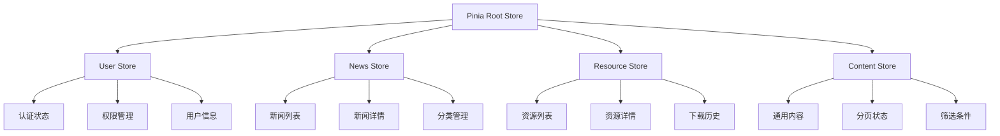

# Vue3项目状态管理层架构技术文档

## 概述

本文档详细分析Vue3项目的第三层架构：**状态管理层**。状态管理是现代前端应用的核心，负责管理应用的数据流、用户状态、业务逻辑和数据持久化。本项目采用Pinia构建了一套完整的状态管理系统，结合TypeScript提供类型安全的开发体验。

## 技术栈

- **Pinia** - Vue3官方推荐的状态管理库
- **TypeScript** - 提供完整的类型安全
- **pinia-plugin-persistedstate** - 状态持久化插件
- **@vueuse/core** - Vue组合式工具集
- **Axios** - HTTP客户端与状态集成

## 1. 状态管理架构概览

### 1.1 Store模块化设计

```
src/stores/
├── user.ts          # 用户状态管理
├── news.ts          # 新闻内容状态
├── resource.ts      # 资源管理状态
└── content.ts       # 通用内容状态
```

### 1.2 状态层次结构



## 2. 用户状态管理深度分析

### 2.1 用户Store核心设计

```typescript
export const useUserStore = defineStore(
  "user",
  () => {
    const token = ref<string | null>(null);
    const userInfo = ref<UserInfo | null>(null);
    const loading = ref(false);

    // 计算属性 - 响应式权限状态
    const isAuthenticated = computed(() => !!token.value);
    const isAdmin = computed(() => userInfo.value?.role === "admin");
    const isEditor = computed(
      () => userInfo.value?.role === "editor" || isAdmin.value
    );
    const userPermissions = computed(() => userInfo.value?.permissions || []);

    // ... 方法定义
  },
  {
    persist: true, // 启用持久化
  }
);
```

#### 设计亮点：

- **Composition API**: 使用`ref`和`computed`构建响应式状态
- **类型安全**: 完整的TypeScript接口定义
- **角色层次**: 管理员自动继承编辑者权限
- **自动持久化**: 状态自动同步到localStorage

### 2.2 权限转换机制

```typescript
// 权限转换函数：将后端嵌套对象格式转换为前端字符串数组格式
function transformPermissions(backendPermissions: any): string[] {
  const permissions: string[] = [];

  if (!backendPermissions || typeof backendPermissions !== "object") {
    return permissions;
  }

  try {
    for (const [module, actions] of Object.entries(backendPermissions)) {
      if (actions && typeof actions === "object") {
        for (const [action, hasPermission] of Object.entries(
          actions as Record<string, boolean>
        )) {
          if (hasPermission === true) {
            const permissionKey = `${module}:${action}`;
            permissions.push(permissionKey);

            // 如果有特定资源权限，也加入相应的操作权限
            if (action === "manage") {
              permissions.push(`${module}:read`);
              permissions.push(`${module}:create`);
              permissions.push(`${module}:update`);
              permissions.push(`${module}:delete`);
            }
          }
        }
      }
    }
  } catch (error) {
    console.error("权限转换失败:", error);
    return [];
  }

  return Array.from(new Set(permissions));
}
```

#### 权限系统设计特点：

- **格式统一**: 后端嵌套对象 → 前端字符串数组
- **权限继承**: `manage`权限自动包含CRUD权限
- **容错处理**: 转换失败时返回空数组
- **去重机制**: 自动去除重复权限

### 2.3 认证流程管理

```typescript
async function login(payload: LoginPayload): Promise<boolean> {
  try {
    loading.value = true;
    const response = await api.post("/api/auth/login", payload);

    if (response.data?.status === "success") {
      const authToken = response.data.token;
      const userData = response.data.data?.user;

      if (authToken && userData) {
        token.value = authToken;

        // 转换权限格式
        const transformedPermissions = transformPermissions(
          userData.permissions
        );
        const userWithTransformedPermissions = {
          ...userData,
          permissions: transformedPermissions,
        };

        userInfo.value = userWithTransformedPermissions;

        // 记住登录状态
        if (payload.remember) {
          localStorage.setItem("token", authToken);
        }

        // 设置全局请求头
        api.defaults.headers.common["Authorization"] = `Bearer ${authToken}`;

        return true;
      }
    }

    throw new Error(response.data.message || "登录失败，请检查用户名和密码");
  } catch (error: any) {
    console.error("登录错误:", error);
    throw new Error(
      error.response?.data?.message ||
        error.message ||
        "登录失败，请检查网络连接"
    );
  } finally {
    loading.value = false;
  }
}
```

#### 登录流程特点：

- **异常处理**: 完整的错误捕获和重抛机制
- **状态同步**: 登录状态与HTTP客户端同步
- **记住登录**: 可选的登录状态持久化
- **用户友好**: 详细的错误信息提示

### 2.4 权限检查机制

```typescript
function hasPermission(permission: string): boolean {
  // 如果是管理员，始终有权限
  if (userInfo.value?.role === "admin") {
    return true;
  }
  return userPermissions.value.includes(permission);
}
```

#### 权限检查逻辑：

- **管理员特权**: 管理员默认拥有所有权限
- **精确匹配**: 基于字符串的精确权限匹配
- **性能优化**: 计算属性缓存权限数组

## 3. 业务状态管理分析

### 3.1 新闻Store设计

```typescript
export const useNewsStore = defineStore("news", () => {
  // 状态管理
  const loading = ref(false);
  const items = ref<News[]>([]);
  const total = ref(0);
  const page = ref(1);
  const limit = ref(10);
  const currentNews = ref<News | null>(null);

  // 缓存最近访问的新闻
  const { items: recentlyViewed, addItem: addToRecentlyViewed } =
    useRecentlyViewed<News>("recently-viewed-news");

  // 筛选条件
  const filters = ref({
    keyword: "",
    category: "",
    status: "",
    tag: "",
    startDate: "",
    endDate: "",
  });

  // 计算属性
  const totalPages = computed(() => Math.ceil(total.value / limit.value));
  const hasMore = computed(() => page.value < totalPages.value);
  const pagination = computed(() => ({
    current: page.value,
    pageSize: limit.value,
    total: total.value,
    showSizeChanger: true,
    showQuickJumper: true,
  }));

  // 业务方法
  const fetchList = async (params?: Partial<NewsQueryParams>) => {
    try {
      loading.value = true;
      const response = await newsService.getList({
        ...getQueryParams(),
        ...params,
      });

      items.value = response.data;
      if (response.pagination) {
        total.value = response.pagination.total;
        page.value = response.pagination.page;
        limit.value = response.pagination.limit;
      }
    } finally {
      loading.value = false;
    }
  };

  const fetchById = async (id: string) => {
    try {
      loading.value = true;
      const response = await newsService.getDetail(id);
      currentNews.value = response.data;

      // 添加到最近访问
      if (response.data) {
        addToRecentlyViewed(response.data);
      }

      return response.data;
    } finally {
      loading.value = false;
    }
  };
});
```

#### 新闻Store特点：

- **列表管理**: 完整的分页、筛选、搜索功能
- **详情缓存**: 当前新闻的单独状态管理
- **用户行为**: 最近访问记录的自动维护
- **响应式计算**: 分页信息的自动计算

### 3.2 资源Store设计

```typescript
export const useResourceStore = defineStore("resource", () => {
  // 状态定义
  const loading = ref(false);
  const items = ref<Resource[]>([]);
  const selectedResources = ref<Resource[]>([]);

  // 最近下载的资源
  const { items: recentlyDownloaded, addItem: addToRecentlyDownloaded } =
    useRecentlyViewed<Resource>("recently-downloaded-resources");

  // 筛选条件
  const filters = ref<ResourceFilters>({
    category: "",
    type: "",
    keyword: "",
    status: "",
    tags: [],
  });

  // 计算属性
  const pagination = computed(() => ({
    current: page.value,
    pageSize: limit.value,
    total: total.value,
    showSizeChanger: true,
    showQuickJumper: true,
  }));

  const hasSelected = computed(() => selectedResources.value.length > 0);
});
```

#### 资源Store特点：

- **批量操作**: 支持多选资源的批量处理
- **下载追踪**: 最近下载资源的历史记录
- **复杂筛选**: 多维度的资源筛选功能
- **状态计算**: 选择状态的响应式计算

## 4. 状态持久化策略

### 4.1 Pinia持久化配置

```typescript
// main.ts中的配置
import { createPinia } from "pinia";
import piniaPluginPersistedstate from "pinia-plugin-persistedstate";

const pinia = createPinia();
pinia.use(piniaPluginPersistedstate);
```

### 4.2 Store级别持久化

```typescript
export const useUserStore = defineStore(
  "user",
  () => {
    // Store定义
  },
  {
    persist: true, // 简单持久化
  }
);

// 或者更复杂的配置
export const useNewsStore = defineStore(
  "news",
  () => {
    // Store定义
  },
  {
    persist: {
      key: "news-store",
      storage: sessionStorage, // 使用sessionStorage
      paths: ["filters", "page"], // 只持久化特定字段
    },
  }
);
```

#### 持久化策略：

- **全量持久化**: 用户状态完整保存
- **选择性持久化**: 业务状态部分保存
- **存储选择**: localStorage vs sessionStorage
- **生命周期管理**: 自动的序列化和反序列化

## 5. 组合式函数状态管理

### 5.1 最近访问记录Hook

```typescript
import { useStorage } from "@vueuse/core";

export function useRecentlyViewed<T extends HasId>(
  key: string,
  maxItems: number = 10
) {
  const items = useStorage<T[]>(key, []);

  const addItem = (item: T) => {
    const index = items.value.findIndex((existing) => existing.id === item.id);
    if (index > -1) {
      items.value.splice(index, 1);
    }
    items.value.unshift(item);
    if (items.value.length > maxItems) {
      items.value.pop();
    }
  };

  const removeItem = (id: string) => {
    const index = items.value.findIndex((item) => item.id === id);
    if (index > -1) {
      items.value.splice(index, 1);
    }
  };

  const clearItems = () => {
    items.value = [];
  };

  return {
    items,
    addItem,
    removeItem,
    clearItems,
  };
}
```

#### Composable特点：

- **泛型设计**: 支持任意类型的对象
- **自动持久化**: 基于@vueuse/core的存储
- **LRU算法**: 最近最少使用的缓存策略
- **类型安全**: 完整的TypeScript支持

### 5.2 权限管理Hook

```typescript
// composables/usePermission.ts
import { computed } from "vue";
import { useUserStore } from "@/stores/user";

export function usePermission() {
  const userStore = useUserStore();

  const hasPermission = (permission: string | string[]) => {
    if (Array.isArray(permission)) {
      return permission.some((p) => userStore.hasPermission(p));
    }
    return userStore.hasPermission(permission);
  };

  const hasRole = (role: string | string[]) => {
    const userRole = userStore.userInfo?.role;
    if (!userRole) return false;

    if (Array.isArray(role)) {
      return role.includes(userRole);
    }
    return userRole === role;
  };

  const hasAnyPermission = (permissions: string[]) => {
    return permissions.some((permission) =>
      userStore.hasPermission(permission)
    );
  };

  const hasAllPermissions = (permissions: string[]) => {
    return permissions.every((permission) =>
      userStore.hasPermission(permission)
    );
  };

  return {
    hasPermission,
    hasRole,
    hasAnyPermission,
    hasAllPermissions,
    isAuthenticated: computed(() => userStore.isAuthenticated),
    isAdmin: computed(() => userStore.isAdmin),
    isEditor: computed(() => userStore.isEditor),
  };
}
```

## 6. 服务层与状态层集成

### 6.1 基础服务类设计

```typescript
export abstract class BaseService<T> {
  constructor(
    protected endpoint: string,
    protected useCache = true,
    protected defaultCacheOptions: CacheOptions = {}
  ) {}

  protected getCacheKey(key: string, params?: Record<string, any>): string {
    const base = `${this.endpoint}:${key}`;
    return params ? `${base}:${JSON.stringify(params)}` : base;
  }

  protected cacheResponse<R>(
    key: string,
    response: ApiResponse<R>,
    params?: Record<string, any>
  ) {
    if (!this.useCache) return;
    const cacheKey = this.getCacheKey(key, params);
    apiCache.set(cacheKey, response, {
      params,
      tags: [this.endpoint, key],
      ...this.defaultCacheOptions,
    });
  }

  async getAll(params?: QueryParams): Promise<ApiResponse<T[]>> {
    const cacheKey = "list";
    const cached = this.getCached<ApiResponse<T[]>>(cacheKey, params);
    if (cached) return cached;

    const response = await api.get(this.endpoint, { params });
    const apiResponse: ApiResponse<T[]> = {
      success: response.status >= 200 && response.status < 300,
      data: response.data,
    };

    this.cacheResponse(cacheKey, apiResponse, params);
    return apiResponse;
  }
}
```

#### 服务层特点：

- **抽象基类**: 通用的CRUD操作封装
- **缓存集成**: API级别的智能缓存
- **类型安全**: 完整的泛型支持
- **标准化**: 统一的响应格式

### 6.2 状态与API的集成模式

```typescript
// Store中的API调用模式
const fetchList = async (params?: Partial<NewsQueryParams>) => {
  try {
    loading.value = true;
    const response = await newsService.getList({
      ...filters.value,
      ...params,
    });

    // 状态更新
    items.value = response.data;
    if (response.pagination) {
      total.value = response.pagination.total;
      page.value = response.pagination.page;
      limit.value = response.pagination.limit;
    }
  } catch (error) {
    console.error("获取列表失败:", error);
    throw error;
  } finally {
    loading.value = false;
  }
};
```

## 7. 状态管理最佳实践

### 7.1 状态设计原则

1. **单一数据源**: 每个状态只有一个数据源
2. **不可变性**: 通过替换而非修改来更新状态
3. **响应式设计**: 充分利用Vue的响应式系统
4. **类型安全**: 完整的TypeScript类型定义

### 7.2 性能优化策略

1. **计算属性缓存**: 使用computed缓存派生状态
2. **选择性持久化**: 只持久化必要的状态
3. **懒加载**: 按需加载Store模块
4. **缓存策略**: API响应的智能缓存

### 7.3 错误处理机制

```typescript
// 统一的错误处理模式
async function apiCall<T>(
  apiFunction: () => Promise<T>,
  errorMessage = "操作失败"
): Promise<T | null> {
  try {
    loading.value = true;
    return await apiFunction();
  } catch (error) {
    console.error(errorMessage, error);
    // 可以在这里集成全局错误处理
    throw error;
  } finally {
    loading.value = false;
  }
}
```

### 7.4 状态同步策略

```typescript
// 跨Store状态同步
export const useDataSync = () => {
  const userStore = useUserStore();
  const newsStore = useNewsStore();

  // 监听用户状态变化，同步相关业务状态
  watch(
    () => userStore.isAuthenticated,
    (authenticated) => {
      if (!authenticated) {
        // 清除用户相关的业务状态
        newsStore.$reset();
      }
    }
  );
};
```

## 8. 状态管理架构总结

### 8.1 架构优势

1. **模块化设计**: 按业务域划分的清晰Store结构
2. **类型安全**: 完整的TypeScript类型系统
3. **响应式**: 基于Vue3 Composition API的响应式状态
4. **持久化**: 自动的状态持久化和恢复
5. **缓存策略**: 多层次的数据缓存机制

### 8.2 技术亮点

1. **权限系统**: 完整的RBAC权限管理
2. **状态复用**: 通过Composables实现状态逻辑复用
3. **服务集成**: 状态层与服务层的优雅集成
4. **用户体验**: 最近访问、记住登录等用户友好功能

### 8.3 扩展建议

1. **状态监控**: 添加状态变化的监控和调试工具
2. **离线支持**: 实现离线状态下的数据同步
3. **状态版本控制**: 支持状态的版本管理和回滚
4. **性能监控**: 状态操作的性能监控和优化

## 结论

本项目的状态管理层展现了现代Vue3应用的完整状态管理架构：

### 🏗️ 核心价值

1. **完整的状态生态**: Pinia + TypeScript + 持久化的完整解决方案
2. **优雅的权限设计**: 多层次、可扩展的权限管理系统
3. **响应式的数据流**: 基于Vue3响应式系统的状态管理
4. **良好的开发体验**: 类型安全、热重载、调试友好

### 🔧 实际应用价值

这套状态管理架构为复杂前端应用提供了：

- **可维护的代码结构**
- **类型安全的开发体验**
- **优秀的用户体验**
- **高性能的数据处理**

是现代Vue3项目状态管理的优秀实践案例，为大型前端项目的状态管理提供了完整的解决方案。

---

_文档创建时间: 2025年6月16日_  
_技术版本: Vue 3.x + Pinia 2.x + TypeScript_
