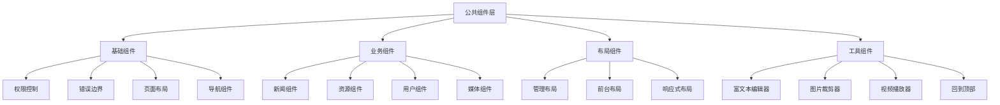

# Vue3项目公共组件层架构技术文档

## 概述

本文档详细分析Vue3项目的第五层架构：**公共组件层**。公共组件层是Vue应用的UI基础设施，提供可复用的组件、统一的交互模式、一致的视觉风格和高效的开发体验。本项目构建了一套完整的组件体系，涵盖基础组件、业务组件、布局组件和工具组件。

## 技术栈

- **Vue 3 Composition API** - 现代组件开发模式
- **TypeScript** - 组件的类型安全保障
- **Element Plus** - 企业级UI组件库
- **Ant Design Vue** - 丰富的组件生态
- **SCSS** - 样式预处理和组件样式管理

## 1. 组件架构概览

### 1.1 组件层次结构



### 1.2 组件文件结构

```
src/components/
├── common/                    # 通用组件
│   ├── HasPermission.vue     # 权限控制组件
│   ├── ErrorBoundary.vue     # 错误边界组件
│   ├── PageLayout.vue        # 页面布局组件
│   ├── BreadcrumbNav.vue     # 面包屑导航
│   ├── QuillEditor.vue       # 富文本编辑器
│   ├── AvatarCropper.vue     # 头像裁剪器
│   └── NewsListItem.vue      # 新闻列表项
├── admin/                     # 管理后台组件
│   ├── AdminLayout.vue       # 管理后台布局
│   ├── AdminHeader.vue       # 管理后台头部
│   └── AdminSidebar.vue      # 管理后台侧边栏
├── BackToTop.vue             # 回到顶部
├── VideoPlayer.vue           # 视频播放器
├── Header.vue                # 前台头部
└── FooterLinks.vue           # 前台底部
```

## 2. 权限控制组件系统

### 2.1 HasPermission组件设计

```vue
<template>
  <slot v-if="hasPermission" />
  <slot
    v-else-if="props.onDenied"
    name="unauthorized"
    @onDenied="props.onDenied()"
  />
  <slot v-else name="unauthorized" />
</template>

<script setup lang="ts">
import { useUserStore } from "../../stores/user";
import { computed } from "vue";

const props = defineProps<{
  permission: string | string[];
  onDenied?: () => void;
}>();

const userStore = useUserStore();

const hasPermission = computed(() => {
  return Array.isArray(props.permission)
    ? props.permission.some((p) => userStore.hasPermission(p))
    : userStore.hasPermission(props.permission);
});
</script>
```

#### 权限组件特点：

- **声明式权限控制**: 通过组件包裹实现权限控制
- **多权限支持**: 支持单个权限和权限数组
- **插槽机制**: 提供默认内容和无权限时的备用内容
- **回调支持**: 支持权限不足时的回调处理
- **OR逻辑**: 权限数组采用OR逻辑，有其一即可

#### 使用示例：

```vue
<!-- 单权限控制 -->
<HasPermission permission="news:create">
  <el-button type="primary">创建新闻</el-button>
</HasPermission>

<!-- 多权限控制 -->
<HasPermission :permission="['news:update', 'news:delete']">
  <el-button>编辑</el-button>
  <template #unauthorized>
    <span>权限不足</span>
  </template>
</HasPermission>

<!-- 带回调的权限控制 -->
<HasPermission
  permission="admin:access"
  :onDenied="() => message.error('需要管理员权限')"
>
  <admin-panel />
</HasPermission>
```

## 3. 错误边界组件系统

### 3.1 ErrorBoundary组件实现

```vue
<template>
  <div v-if="error" class="error-boundary">
    <a-result status="error" :title="error.title" :sub-title="error.message">
      <template #extra>
        <a-button type="primary" @click="handleRetry">重试</a-button>
        <a-button @click="handleBack">返回首页</a-button>
      </template>
    </a-result>
  </div>
  <slot v-else></slot>
</template>

<script setup lang="ts">
import { ref, onErrorCaptured } from "vue";
import { useRouter } from "vue-router";

const router = useRouter();
const error = ref<{ title: string; message: string } | null>(null);

// 捕获错误
onErrorCaptured((err: any) => {
  console.error("Error caught by boundary:", err);

  // 设置错误信息
  error.value = {
    title: "页面加载失败",
    message: err.message || "发生未知错误，请稍后重试",
  };

  return false; // 阻止错误继续传播
});

// 重试
const handleRetry = () => {
  error.value = null;
  window.location.reload();
};

// 返回首页
const handleBack = () => {
  router.push("/");
};
</script>
```

#### 错误边界特点：

- **错误捕获**: 使用onErrorCaptured捕获子组件错误
- **友好界面**: 错误时显示用户友好的界面
- **错误恢复**: 提供重试和返回首页的恢复选项
- **错误阻断**: 阻止错误继续向上传播
- **日志记录**: 在控制台记录详细错误信息

## 4. 布局组件系统

### 4.1 PageLayout通用布局组件

```vue
<template>
  <div :class="['page-container', className]">
    <slot name="header">
      <div class="page-header">
        <h1>{{ title }}</h1>
        <p v-if="description">{{ description }}</p>
      </div>
    </slot>
    <div class="page-content">
      <slot name="content">
        <slot></slot>
      </slot>
    </div>
  </div>
</template>

<script lang="ts">
import { defineComponent } from "vue";

export default defineComponent({
  name: "PageLayout",
  props: {
    title: { type: String, required: true },
    description: { type: String, default: "" },
    className: { type: String, default: "" },
  },
});
</script>
```

#### 布局组件设计：

- **插槽机制**: 灵活的头部和内容插槽
- **默认布局**: 提供标准的页面布局结构
- **可定制性**: 支持自定义样式类和描述
- **语义化**: 清晰的页面结构和语义
- **响应式**: 适配不同屏幕尺寸

### 4.2 AdminSidebar管理后台侧边栏

```vue
<template>
  <div
    class="admin-sidebar"
    :class="{
      'admin-sidebar--collapsed': collapsed,
      'mobile-visible': isMobileVisible,
    }"
  >
    <div class="sidebar-header">
      <div class="logo-container">
        
        <span v-if="!collapsed" class="logo-text">管理后台</span>
      </div>
    </div>

    <div class="sidebar-menu">
      <a-menu
        v-model:selectedKeys="selectedKeys"
        mode="inline"
        theme="dark"
        :inline-collapsed="collapsed"
        @click="handleMenuClick"
      >
        <a-menu-item key="/admin/dashboard">
          <template #icon><DashboardOutlined /></template>
          <span>仪表板</span>
        </a-menu-item>

        <a-sub-menu key="news">
          <template #icon><FileTextOutlined /></template>
          <template #title>新闻管理</template>
          <a-menu-item key="/admin/news/list">新闻列表</a-menu-item>
          <a-menu-item key="/admin/news/create">发布新闻</a-menu-item>
          <a-menu-item key="/admin/news/categories">分类管理</a-menu-item>
        </a-sub-menu>

        <!-- 更多菜单项... -->
      </a-menu>
    </div>
  </div>
</template>
```

#### 侧边栏组件特点：

- **响应式设计**: 适配桌面端和移动端
- **折叠功能**: 支持侧边栏的展开/折叠
- **路由集成**: 与Vue Router深度集成
- **权限控制**: 可结合权限系统隐藏菜单
- **图标支持**: 丰富的图标系统

## 5. 富文本编辑器组件

### 5.1 QuillEditor组件封装

```vue
<template>
  <div class="quill-editor-wrapper">
    <QuillEditor
      ref="quillRef"
      :content="modelValue"
      content-type="html"
      :options="editorOptions"
      @update:content="handleContentChange"
      @ready="onEditorReady"
      class="quill-editor"
    />
  </div>
</template>

<script setup lang="ts">
import { ref, computed, watch } from "vue";
import { QuillEditor } from "@vueup/vue-quill";
import "@vueup/vue-quill/dist/vue-quill.snow.css";

interface Props {
  modelValue: string;
  placeholder?: string;
  height?: string;
  readonly?: boolean;
  theme?: "snow" | "bubble";
}

const props = withDefaults(defineProps<Props>(), {
  placeholder: "请输入内容...",
  height: "300px",
  readonly: false,
  theme: "snow",
});

const emit = defineEmits<{
  (e: "update:modelValue", value: string): void;
  (e: "change", value: string): void;
}>();

// 编辑器配置
const editorOptions = computed(() => ({
  theme: props.theme,
  placeholder: props.placeholder,
  readOnly: props.readonly,
  modules: {
    toolbar: [
      // 文本格式
      [{ header: [1, 2, 3, 4, 5, 6, false] }],
      [{ font: [] }],
      [{ size: ["small", false, "large", "huge"] }],

      // 文本样式
      ["bold", "italic", "underline", "strike"],
      [{ color: [] }, { background: [] }],

      // 段落格式
      [{ align: [] }],
      [{ list: "ordered" }, { list: "bullet" }],
      [{ indent: "-1" }, { indent: "+1" }],

      // 插入内容
      ["link", "image", "video"],
      ["blockquote", "code-block"],

      // 其他
      ["clean"],
    ],
    history: {
      delay: 2000,
      maxStack: 500,
      userOnly: true,
    },
  },
}));

// 暴露方法
defineExpose({
  getQuill: () => quillInstance,
  getText: () => quillInstance?.getText() || "",
  getHTML: () => quillInstance?.root.innerHTML || "",
  setHTML: (html: string) => {
    if (quillInstance?.root) {
      quillInstance.root.innerHTML = html;
    }
  },
  focus: () => quillInstance?.focus(),
  clear: () => {
    if (quillInstance?.root) {
      quillInstance.root.innerHTML = "";
    }
  },
});
</script>
```

#### 富文本编辑器特点：

- **功能完整**: 支持文本格式、样式、段落、插入等功能
- **可配置**: 支持主题、高度、只读等配置
- **双向绑定**: 完整的v-model支持
- **方法暴露**: 提供丰富的操作方法
- **历史记录**: 支持撤销/重做功能

## 6. 媒体组件系统

### 6.1 VideoPlayer视频播放器

```vue
<template>
  <div
    class="video-player-container"
    :class="{ 'is-fullscreen': isFullscreen }"
  >
    <video
      ref="videoRef"
      class="video-element"
      :src="src"
      :poster="poster"
      @timeupdate="onTimeUpdate"
      @loadedmetadata="onLoadedMetadata"
      @play="onPlay"
      @pause="onPause"
      @ended="onEnded"
    >
      您的浏览器不支持 HTML5 视频播放
    </video>

    <div class="video-controls" v-show="showControls">
      <!-- 进度条 -->
      <div class="progress-bar">
        <div class="progress" :style="{ width: progress + '%' }"></div>
        <input
          type="range"
          class="progress-slider"
          :value="progress"
          @input="onProgressChange"
          min="0"
          max="100"
        />
      </div>

      <div class="controls-buttons">
        <!-- 播放/暂停按钮 -->
        <button class="control-button" @click="togglePlay">
          <el-icon :size="20">
            <component :is="isPlaying ? VideoPause : VideoPlay" />
          </el-icon>
        </button>

        <!-- 音量控制 -->
        <div class="volume-control">
          <button class="control-button" @click="toggleMute">
            <el-icon :size="20">
              <component :is="volumeIcon" />
            </el-icon>
          </button>
          <input
            type="range"
            class="volume-slider"
            v-model="volume"
            min="0"
            max="1"
            step="0.1"
            @input="onVolumeChange"
          />
        </div>

        <!-- 时间显示 -->
        <div class="time-display">
          {{ formatTime(currentTime) }} / {{ formatTime(duration) }}
        </div>

        <!-- 全屏按钮 -->
        <button class="control-button" @click="toggleFullscreen">
          <el-icon :size="20">
            <component :is="isFullscreen ? Close : FullScreen" />
          </el-icon>
        </button>
      </div>
    </div>
  </div>
</template>
```

#### 视频播放器特点：

- **自定义控制栏**: 完全自定义的播放控制界面
- **全屏支持**: 支持全屏播放模式
- **进度控制**: 可拖拽的进度条
- **音量控制**: 音量调节和静音功能
- **时间显示**: 当前时间和总时长显示
- **响应式**: 适配不同屏幕尺寸

### 6.2 AvatarCropper头像裁剪器

```vue
<template>
  <el-dialog
    v-model="dialogVisible"
    title="裁剪头像"
    width="500px"
    append-to-body
  >
    <div class="avatar-cropper-container">
      <div class="cropper-container">
        <vue-cropper
          ref="cropperRef"
          :img="imgSrc"
          :output-size="outputSize"
          :output-type="outputType"
          :auto-crop="true"
          :auto-crop-width="200"
          :auto-crop-height="200"
          :fixed="true"
          :fixed-number="[1, 1]"
          @realTime="realTime"
        />
      </div>

      <div class="preview-container">
        <div class="preview-title">预览</div>
        <div class="preview-box">
          <div :style="previews.div" class="preview-content">
            
          </div>
        </div>
      </div>

      <div class="control-container">
        <div class="control-group">
          <div class="control-title">旋转</div>
          <el-button size="small" @click="rotateLeft">逆时针</el-button>
          <el-button size="small" @click="rotateRight">顺时针</el-button>
        </div>

        <div class="control-group">
          <div class="control-title">缩放</div>
          <el-slider v-model="zoom" :min="1" :max="3" :step="0.1" />
        </div>

        <div class="control-group">
          <div class="control-title">图片质量</div>
          <el-slider v-model="outputSize" :min="0.1" :max="1" :step="0.1" />
        </div>
      </div>
    </div>
  </el-dialog>
</template>
```

#### 头像裁剪器特点：

- **实时预览**: 裁剪过程中的实时预览
- **固定比例**: 支持固定长宽比裁剪
- **旋转功能**: 支持图片旋转
- **缩放控制**: 精确的缩放控制
- **质量调节**: 输出图片质量控制
- **弹窗集成**: 集成在对话框中的完整体验

## 7. 交互组件系统

### 7.1 BackToTop回到顶部组件

```vue
<template>
  <div class="back-to-top" :class="{ visible: isVisible }" @click="scrollToTop">
    <i class="fas fa-arrow-up"></i>
  </div>
</template>

<script setup lang="ts">
import { ref, onMounted, onUnmounted } from "vue";

const isVisible = ref(false);

// 滚动事件处理函数
const handleScroll = () => {
  isVisible.value = window.scrollY > 300;
};

// 回到顶部的函数
const scrollToTop = () => {
  window.scrollTo({
    top: 0,
    behavior: "smooth",
  });
};

onMounted(() => {
  window.addEventListener("scroll", handleScroll);
});

onUnmounted(() => {
  window.removeEventListener("scroll", handleScroll);
});
</script>

<style lang="scss" scoped>
.back-to-top {
  position: fixed;
  bottom: 40px;
  right: 40px;
  width: 50px;
  height: 50px;
  border-radius: 50%;
  background-color: rgba(154, 35, 20, 0.85);
  color: white;
  display: flex;
  align-items: center;
  justify-content: center;
  cursor: pointer;
  opacity: 0;
  visibility: hidden;
  transform: translateY(20px);
  transition: all 0.3s ease;
  z-index: 999;

  &:hover {
    background-color: #9a2314;
    transform: translateY(0) scale(1.1);
  }

  &.visible {
    opacity: 1;
    visibility: visible;
    transform: translateY(0);
  }

  @media (max-width: 768px) {
    bottom: 20px;
    right: 20px;
    width: 45px;
    height: 45px;
  }
}
</style>
```

#### 回到顶部组件特点：

- **滚动检测**: 根据滚动位置控制显示
- **平滑滚动**: 使用CSS平滑滚动效果
- **动画过渡**: 优雅的显示/隐藏动画
- **悬浮效果**: 鼠标悬停的缩放效果
- **响应式**: 移动端适配

### 7.2 BreadcrumbNav面包屑导航

```vue
<template>
  <div class="breadcrumb-nav">
    <a-breadcrumb>
      <a-breadcrumb-item v-for="(item, index) in items" :key="index">
        <template v-if="item.link">
          <router-link :to="item.link">{{ item.title }}</router-link>
        </template>
        <template v-else>
          {{ item.title }}
        </template>
      </a-breadcrumb-item>
    </a-breadcrumb>
  </div>
</template>

<script lang="ts">
interface BreadcrumbItem {
  title: string;
  link?: string;
}

export default defineComponent({
  name: "BreadcrumbNav",
  props: {
    items: {
      type: Array as () => BreadcrumbItem[],
      required: true,
    },
  },
});
</script>
```

#### 面包屑导航特点：

- **路径导航**: 清晰的页面层级导航
- **链接支持**: 支持可点击和不可点击项
- **类型安全**: TypeScript接口定义
- **样式定制**: 可自定义的样式

## 8. 业务组件系统

### 8.1 NewsListItem新闻列表项

```vue
<template>
  <div class="news-item">
    <div class="news-content">
      <h3 class="news-title">
        <router-link :to="`/news/detail/${news._id || news.id}`">
          {{ news.title }}
        </router-link>
      </h3>
      <p class="news-summary" v-if="news.summary">{{ news.summary }}</p>
      <div class="news-meta">
        <span class="news-date">{{
          formatDate(news.publishDate || news.createdAt)
        }}</span>
        <span class="news-author" v-if="news.author">
          作者：{{ getAuthorName(news.author) }}
        </span>
        <span class="news-views" v-if="news.viewCount">
          阅读：{{ news.viewCount }}
        </span>
        <span class="news-category" v-if="news.category">
          分类：{{ getCategoryName(news.category) }}
        </span>
      </div>
    </div>
    <div class="news-cover" v-if="news.cover">
      
    </div>
  </div>
</template>

<script lang="ts">
export default defineComponent({
  name: "NewsListItem",
  props: {
    news: { type: Object as () => News, required: true },
  },
  methods: {
    formatDate(date: string) {
      return new Date(date).toLocaleDateString("zh-CN", {
        year: "numeric",
        month: "2-digit",
        day: "2-digit",
      });
    },
    getAuthorName(author: any) {
      return typeof author === "object" ? author.username : author;
    },
    getCategoryName(category: any) {
      return typeof category === "object" ? category.name : category;
    },
  },
});
</script>
```

#### 新闻列表项特点：

- **数据适配**: 兼容不同的数据结构
- **元信息显示**: 丰富的新闻元信息
- **响应式布局**: 自适应的卡片布局
- **交互效果**: 悬停动画效果
- **图片支持**: 可选的封面图片显示

## 9. 组件设计模式

### 9.1 组合式API模式

```vue
<script setup lang="ts">
// 1. 导入依赖
import { ref, computed, watch, onMounted } from "vue";
import { useRouter } from "vue-router";

// 2. 定义props和emits
interface Props {
  modelValue: string;
  disabled?: boolean;
}

interface Emits {
  (e: "update:modelValue", value: string): void;
  (e: "change", value: string): void;
}

const props = withDefaults(defineProps<Props>(), {
  disabled: false,
});

const emit = defineEmits<Emits>();

// 3. 响应式状态
const inputValue = ref(props.modelValue);
const isValid = ref(true);

// 4. 计算属性
const computedClass = computed(() => ({
  "is-disabled": props.disabled,
  "is-invalid": !isValid.value,
}));

// 5. 监听器
watch(
  () => props.modelValue,
  (newValue) => {
    inputValue.value = newValue;
  }
);

// 6. 方法
const handleInput = (value: string) => {
  inputValue.value = value;
  emit("update:modelValue", value);
  emit("change", value);
};

// 7. 生命周期
onMounted(() => {
  // 初始化逻辑
});

// 8. 暴露给父组件
defineExpose({
  focus: () => {
    // 暴露的方法
  },
});
</script>
```

### 9.2 插槽设计模式

```vue
<template>
  <div class="container">
    <!-- 具名插槽 -->
    <header class="header">
      <slot name="header" :title="title">
        <h1>{{ title }}</h1>
      </slot>
    </header>

    <!-- 作用域插槽 -->
    <main class="content">
      <slot name="content" :data="data" :loading="loading">
        <div v-if="loading">加载中...</div>
        <div v-else v-for="item in data" :key="item.id">
          {{ item.title }}
        </div>
      </slot>
    </main>

    <!-- 默认插槽 -->
    <footer class="footer">
      <slot>
        <p>默认底部内容</p>
      </slot>
    </footer>
  </div>
</template>
```

### 9.3 条件渲染模式

```vue
<template>
  <div>
    <!-- 权限控制 -->
    <template v-if="hasPermission">
      <admin-panel />
    </template>
    <template v-else>
      <access-denied />
    </template>

    <!-- 加载状态 -->
    <div v-if="loading" class="loading">
      <a-spin size="large" />
    </div>
    <div v-else-if="error" class="error">
      <a-result status="error" :title="error.message" />
    </div>
    <div v-else class="content">
      <slot />
    </div>
  </div>
</template>
```

## 10. 组件性能优化

### 10.1 懒加载组件

```typescript
// 路由级懒加载
const AdminPanel = () => import("@/components/admin/AdminPanel.vue");

// 组件级懒加载
import { defineAsyncComponent } from "vue";

const AsyncComponent = defineAsyncComponent({
  loader: () => import("./HeavyComponent.vue"),
  loadingComponent: LoadingSpinner,
  errorComponent: ErrorComponent,
  delay: 200,
  timeout: 3000,
});
```

### 10.2 组件缓存策略

```vue
<template>
  <keep-alive :include="cacheableComponents">
    <component :is="currentComponent" />
  </keep-alive>
</template>

<script setup lang="ts">
const cacheableComponents = ["UserProfile", "NewsDetail", "ResourceList"];
</script>
```

### 10.3 虚拟滚动组件

```vue
<template>
  <div class="virtual-list" :style="{ height: containerHeight + 'px' }">
    <div
      class="virtual-list-phantom"
      :style="{ height: totalHeight + 'px' }"
    ></div>
    <div
      class="virtual-list-content"
      :style="{ transform: `translateY(${offset}px)` }"
    >
      <div
        v-for="item in visibleData"
        :key="item.id"
        class="virtual-list-item"
        :style="{ height: itemHeight + 'px' }"
      >
        <slot :item="item" :index="item.index"></slot>
      </div>
    </div>
  </div>
</template>
```

## 11. 组件测试策略

### 11.1 单元测试

```typescript
import { mount } from "@vue/test-utils";
import { describe, it, expect } from "vitest";
import HasPermission from "@/components/common/HasPermission.vue";

describe("HasPermission", () => {
  it("should render content when user has permission", () => {
    const wrapper = mount(HasPermission, {
      props: { permission: "test:read" },
      slots: { default: "<div>Protected Content</div>" },
      global: {
        provide: {
          userStore: { hasPermission: () => true },
        },
      },
    });

    expect(wrapper.text()).toContain("Protected Content");
  });

  it("should not render content when user lacks permission", () => {
    const wrapper = mount(HasPermission, {
      props: { permission: "test:read" },
      slots: { default: "<div>Protected Content</div>" },
      global: {
        provide: {
          userStore: { hasPermission: () => false },
        },
      },
    });

    expect(wrapper.text()).not.toContain("Protected Content");
  });
});
```

### 11.2 集成测试

```typescript
import { mount } from "@vue/test-utils";
import { createRouter, createWebHistory } from "vue-router";
import AdminSidebar from "@/components/admin/AdminSidebar.vue";

describe("AdminSidebar Integration", () => {
  it("should navigate to correct route when menu item clicked", async () => {
    const router = createRouter({
      history: createWebHistory(),
      routes: [
        {
          path: "/admin/dashboard",
          component: { template: "<div>Dashboard</div>" },
        },
      ],
    });

    const wrapper = mount(AdminSidebar, {
      global: {
        plugins: [router],
      },
    });

    await wrapper.find('[data-testid="dashboard-menu"]').trigger("click");
    expect(router.currentRoute.value.path).toBe("/admin/dashboard");
  });
});
```

## 12. 组件最佳实践

### 12.1 组件设计原则

1. **单一职责**: 每个组件只负责一个功能
2. **高内聚低耦合**: 组件内部逻辑紧密，组件间依赖最小
3. **可复用性**: 通过props和slots实现灵活复用
4. **可测试性**: 易于编写单元测试和集成测试
5. **一致性**: 统一的命名规范和代码风格

### 12.2 性能优化原则

1. **按需加载**: 大型组件使用异步加载
2. **合理缓存**: 适当使用keep-alive缓存组件
3. **虚拟滚动**: 长列表使用虚拟滚动技术
4. **事件优化**: 及时清理事件监听器
5. **内存管理**: 避免内存泄漏

### 12.3 可维护性原则

1. **TypeScript**: 使用类型定义增强代码可维护性
2. **文档注释**: 完善的组件文档和注释
3. **版本控制**: 组件版本管理和变更记录
4. **测试覆盖**: 充分的测试覆盖率
5. **代码规范**: 统一的代码风格和规范

## 结论

本项目的公共组件层展现了现代Vue3应用的完整组件体系：

### 🏗️ 架构优势

1. **完整的组件生态**: 从基础到业务的全方位组件覆盖
2. **类型安全保障**: TypeScript提供的完整类型系统
3. **灵活的设计模式**: 插槽、组合式API等现代设计模式
4. **优秀的用户体验**: 丰富的交互组件和动画效果
5. **高度可复用性**: 良好的组件抽象和接口设计

### 🔧 技术亮点

1. **权限控制系统**: 声明式的权限控制组件
2. **错误边界机制**: 优雅的错误处理和用户体验
3. **富媒体支持**: 完整的视频播放器和图片裁剪器
4. **响应式设计**: 全面的移动端适配
5. **性能优化**: 懒加载、虚拟滚动等性能优化技术

### 📈 实际价值

这套公共组件层为企业级前端应用提供了：

- **统一的交互体验**
- **高效的开发效率**
- **可维护的代码结构**
- **优秀的用户界面**
- **完善的功能支持**

是现代Vue3项目组件开发的优秀实践案例，为复杂前端应用的UI构建提供了完整的解决方案。

---

_文档创建时间: 2025年6月16日_  
_技术版本: Vue 3.x + TypeScript + Element Plus + Ant Design Vue_
