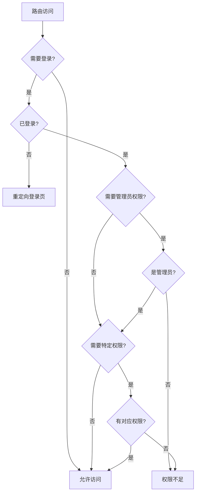

# Vue3项目路由与导航层架构技术文档

## 概述

本文档详细分析Vue3项目的第二层架构：**路由与导航层**。路由系统是Vue单页应用(SPA)的核心，定义了应用的页面结构、导航流程、权限控制和用户体验。本项目采用Vue Router 4构建了一套完整的前后台分离路由架构。

## 技术栈

- **Vue Router 4** - Vue3官方路由管理器
- **TypeScript** - 路由配置的类型安全
- **Ant Design Vue** - 消息提示组件
- **Pinia** - 状态管理(用于权限控制)

## 1. 路由配置架构分析

### 1.1 核心路由文件结构

```
src/router/
├── index.ts          # 主路由配置文件
└── (其他路由模块)     # 可扩展的模块化路由
```

### 1.2 路由元数据类型扩展

```typescript
declare module "vue-router" {
  interface RouteMeta {
    requiresAuth?: boolean; // 是否需要登录
    adminOnly?: boolean; // 是否仅管理员可访问
    permissions?: string[]; // 所需权限列表
    keepAlive?: boolean; // 是否缓存组件
    title?: string; // 页面标题
  }
}
```

#### 设计亮点：

- **类型安全**: 通过模块声明扩展Vue Router的RouteMeta接口
- **权限粒度**: 支持登录验证、角色控制、权限控制三个层级
- **性能优化**: 通过keepAlive控制组件缓存
- **用户体验**: 自定义页面标题

### 1.3 基础路径配置策略

```typescript
const getBase = (): string => {
  // 检查是否有环境变量
  if (import.meta.env.VITE_BASE_URL) {
    return import.meta.env.VITE_BASE_URL;
  }
  // 否则使用默认的BASE_URL
  return import.meta.env.BASE_URL || "/";
};
```

#### 部署灵活性：

- **环境变量优先**: 支持VITE_BASE_URL环境变量
- **构建时配置**: 回退到构建时的BASE_URL
- **默认路径**: 最终回退到根路径"/"

## 2. 路由结构设计

### 2.1 前台路由架构

```typescript
// 前台公共页面
{
  path: "/",
  name: "home",
  component: () => import("../views/Home.vue"),
},
{
  path: "/news",
  name: "news",
  component: () => import("../views/News.vue"),
},
{
  path: "/news/detail/:id",
  name: "newsDetail",
  component: () => import("../views/NewsDetail.vue"),
  props: true,  // 启用props传参
}
```

#### 前台路由特点：

- **无权限限制**: 公开访问的页面
- **动态路由**: 支持参数传递(如:id)
- **Props传参**: 自动将路由参数转为组件props
- **懒加载**: 所有组件采用动态导入

### 2.2 用户中心路由架构

```typescript
{
  path: "/user",
  component: () => import("../views/user/UserLayout.vue"),
  meta: {
    requiresAuth: true,  // 需要登录
  },
  children: [
    {
      path: "",
      redirect: "/user/profile",  // 默认重定向
    },
    {
      path: "profile",
      name: "userProfile",
      component: () => import("../views/user/UserProfile.vue"),
    },
    // ... 其他子路由
  ],
}
```

#### 嵌套路由设计：

- **布局复用**: 共享UserLayout布局组件
- **权限控制**: 整个模块需要登录验证
- **默认重定向**: 访问/user自动重定向到profile
- **模块化组织**: 相关功能页面集中管理

### 2.3 管理后台路由架构

```typescript
{
  path: "/admin",
  component: () => import("../components/admin/AdminLayout.vue"),
  meta: {
    requiresAuth: true,
    adminOnly: true,      // 仅管理员可访问
  },
  children: [
    {
      path: "news",
      children: [
        {
          path: "list",
          name: "adminNewsList",
          component: () => import("../views/admin/news/NewsList.vue"),
          meta: {
            keepAlive: true,
            permissions: ["news:read"],  // 具体权限控制
            title: "新闻列表",
          },
        },
        // ... 更多子路由
      ],
    },
  ],
}
```

#### 管理后台特色：

- **三级路由**: admin -> 模块 -> 功能页面
- **多层权限**: adminOnly + 具体权限控制
- **组件缓存**: 列表页面启用keepAlive
- **功能分组**: 按业务模块组织路由结构

## 3. 路由守卫与权限控制

### 3.1 全局前置守卫

```typescript
router.beforeEach(async (to, _from, next) => {
  const userStore = useUserStore();

  // 如果需要验证
  if (to.matched.some((record) => record.meta.requiresAuth)) {
    if (!userStore.isAuthenticated) {
      // 未登录，根据路径判断重定向到不同的登录页
      const isAdminRoute = to.path.startsWith("/admin");
      const loginPath = isAdminRoute ? "/admin/login" : "/auth";

      return next({
        path: loginPath,
        query: { redirect: to.fullPath },
      });
    }

    // 检查管理员权限
    if (to.meta.adminOnly && !userStore.isAdmin) {
      message.error("您没有访问该页面的权限");
      return next({ path: "/admin/dashboard" });
    }

    // 检查具体权限
    if (to.meta.permissions) {
      const requiredPermissions = to.meta.permissions as string[];
      const hasPermission = requiredPermissions.some((permission) =>
        userStore.hasPermission(permission)
      );

      if (!hasPermission) {
        message.error("您没有访问该页面的权限");
        return next({ path: "/admin/dashboard" });
      }
    }
  }

  next();
});
```

#### 权限验证流程：

1. **登录状态检查**: 验证用户是否已登录
2. **智能重定向**: 前台/后台分别重定向到对应登录页
3. **角色权限验证**: 检查管理员角色
4. **细粒度权限**: 验证具体功能权限
5. **友好提示**: 权限不足时显示错误信息

### 3.2 权限控制层级



## 4. 权限指令系统

### 4.1 自定义指令实现

```typescript
// src/directives/permission.ts
import { type Directive, type DirectiveBinding } from "vue";
import { useUserStore } from "../stores/user";

type PermissionValue = string | string[];

export default {
  mounted(el: HTMLElement, binding: DirectiveBinding<PermissionValue>) {
    const userStore = useUserStore();
    const { value } = binding;

    if (typeof value === "string") {
      if (!userStore.hasPermission(value)) {
        el.parentNode?.removeChild(el);
      }
    } else if (Array.isArray(value)) {
      const hasPermission = value.some((permission) =>
        userStore.hasPermission(permission)
      );
      if (!hasPermission) {
        el.parentNode?.removeChild(el);
      }
    }
  },
} as Directive<HTMLElement, PermissionValue>;
```

#### 指令特点：

- **类型安全**: 支持字符串和数组两种权限格式
- **逻辑清晰**: 单权限AND逻辑，多权限OR逻辑
- **DOM操作**: 直接移除无权限元素
- **性能优化**: 在mounted阶段一次性检查

### 4.2 指令插件注册

```typescript
// src/directives/index.ts
import { App } from "vue";
import permissionDirective from "./permission";
import hasPermissionComponent from "../components/common/HasPermission.vue";

export default {
  install(app: App) {
    // 注册 v-permission 指令
    app.directive("permission", permissionDirective);

    // 注册 HasPermission 组件
    app.component("HasPermission", hasPermissionComponent);
  },
};
```

#### 使用示例：

```vue
<!-- 单权限控制 -->
<el-button v-permission="'news:create'">创建新闻</el-button>

<!-- 多权限控制(有其一即可) -->
<div v-permission="['news:update', 'news:delete']">
  编辑或删除操作
</div>
```

## 5. 导航组件架构

### 5.1 前台导航组件

```vue
<!-- Header.vue 核心导航逻辑 -->
<template>
  <header class="header" :class="{ 'header-scrolled': isScrolled }">
    <nav class="desktop-nav">
      <router-link to="/" class="nav-item">首页</router-link>
      <router-link to="/about" class="nav-item">平台简介</router-link>

      <!-- 下拉菜单导航 -->
      <el-dropdown trigger="hover" class="nav-dropdown">
        <router-link to="/news" class="nav-item">资讯中心</router-link>
        <template #dropdown>
          <el-dropdown-menu>
            <el-dropdown-item>
              <router-link to="/news?category=center">中心动态</router-link>
            </el-dropdown-item>
          </el-dropdown-menu>
        </template>
      </el-dropdown>
    </nav>

    <!-- 用户状态相关导航 -->
    <div class="user-menu" v-if="isAuthenticated">
      <el-dropdown @command="handleCommand">
        <span class="user-dropdown-link">
          <el-avatar :size="32" :src="userInfo?.avatar" />
          {{ userInfo?.name }}
        </span>
        <template #dropdown>
          <el-dropdown-menu>
            <el-dropdown-item command="profile">个人中心</el-dropdown-item>
            <el-dropdown-item command="logout">退出登录</el-dropdown-item>
          </el-dropdown-menu>
        </template>
      </el-dropdown>
    </div>
  </header>
</template>
```

#### 前台导航特点：

- **响应式设计**: 桌面端和移动端不同的导航方式
- **下拉菜单**: 二级导航的优雅实现
- **用户状态**: 根据登录状态显示不同内容
- **滚动效果**: 滚动时的导航栏样式变化

### 5.2 后台导航组件

```vue
<!-- AdminLayout.vue 核心布局逻辑 -->
<template>
  <div class="admin-layout">
    <AdminSidebar
      :collapsed="sidebarCollapsed"
      @toggle="toggleSidebar"
      @menu-click="handleMenuClick"
    />
    <div class="admin-main">
      <AdminHeader @toggle-sidebar="toggleSidebar" />
      <div class="admin-content">
        <router-view v-slot="{ Component, route }">
          <keep-alive>
            <component :is="Component" v-if="route.meta.keepAlive" />
          </keep-alive>
          <component :is="Component" v-if="!route.meta.keepAlive" />
        </router-view>
      </div>
    </div>
  </div>
</template>
```

#### 后台导航特点：

- **侧边栏布局**: 管理后台的经典布局
- **可折叠设计**: 支持侧边栏折叠/展开
- **条件缓存**: 根据路由meta决定是否缓存组件
- **移动端适配**: 响应式的侧边栏显示

## 6. 路由性能优化

### 6.1 代码分割策略

```typescript
// 懒加载导入
component: () => import("../views/Home.vue");

// 带注释的代码分割
component: () =>
  import(
    /* webpackChunkName: "admin-news" */
    "../views/admin/news/NewsList.vue"
  );
```

#### 分割策略：

- **页面级分割**: 每个页面独立打包
- **模块级分割**: 管理后台模块独立打包
- **按需加载**: 只有访问时才加载对应代码
- **缓存优化**: 相同模块的组件可以共享chunk

### 6.2 组件缓存策略

```vue
<router-view v-slot="{ Component, route }">
  <keep-alive>
    <component 
      :is="Component" 
      v-if="route.meta.keepAlive"
      :key="route.fullPath"
    />
  </keep-alive>
  <component 
    :is="Component" 
    v-if="!route.meta.keepAlive"
    :key="route.fullPath"
  />
</router-view>
```

#### 缓存策略：

- **条件缓存**: 根据路由meta控制缓存
- **key策略**: 使用fullPath确保正确的组件更新
- **性能平衡**: 列表页缓存，表单页不缓存

## 7. 路由最佳实践

### 7.1 路由设计原则

1. **RESTful风格**: 路由路径符合RESTful规范

   ```typescript
   /admin/news/list     # 新闻列表
   /admin/news/create   # 创建新闻
   /admin/news/edit/:id # 编辑新闻
   ```

2. **层次化结构**: 路由嵌套反映功能层次

   ```typescript
   /admin              # 管理后台
   ├── /news          # 新闻模块
   │   ├── /list      # 列表页
   │   ├── /create    # 创建页
   │   └── /edit/:id  # 编辑页
   └── /users         # 用户模块
   ```

3. **权限粒度**: 路由权限设计合理
   - 页面级权限: requiresAuth, adminOnly
   - 功能级权限: permissions数组
   - 组件级权限: v-permission指令

### 7.2 用户体验优化

1. **智能重定向**: 根据用户角色重定向到合适页面
2. **错误提示**: 权限不足时的友好提示
3. **登录回跳**: 登录后返回原访问页面
4. **页面过渡**: 平滑的页面切换动画

### 7.3 开发维护性

1. **类型安全**: TypeScript提供完整的类型检查
2. **模块化**: 可扩展的路由模块组织
3. **配置化**: 权限控制通过配置实现
4. **文档化**: 完善的路由注释和文档

## 8. 扩展建议

### 8.1 功能扩展

1. **面包屑导航**: 自动生成基于路由的面包屑
2. **页签管理**: 多页签的页面管理系统
3. **路由动画**: 更丰富的页面切换动画
4. **路由监控**: 用户访问路径的统计分析

### 8.2 性能优化

1. **预加载**: 智能预加载下一可能访问的页面
2. **缓存策略**: 更细粒度的组件缓存控制
3. **懒加载**: 图片和组件的懒加载优化
4. **CDN缓存**: 静态资源的CDN缓存策略

### 8.3 安全加固

1. **路由加密**: 敏感路由的加密处理
2. **访问日志**: 用户路由访问的日志记录
3. **异常监控**: 路由错误的监控和报警
4. **权限审计**: 权限变更的审计日志

## 结论

本项目的路由与导航层展现了现代Vue3应用的完整路由架构：

### 🏗️ 架构优势

1. **清晰的层次结构**: 前台/后台/用户中心的三层架构
2. **完善的权限体系**: 登录→角色→权限的三级权限控制
3. **优秀的用户体验**: 智能重定向、友好提示、平滑过渡
4. **良好的性能表现**: 代码分割、组件缓存、懒加载

### 🔧 技术亮点

1. **TypeScript集成**: 路由配置的完整类型安全
2. **权限指令**: 细粒度的组件级权限控制
3. **响应式导航**: 适配桌面端和移动端的导航体验
4. **模块化设计**: 可维护和可扩展的路由组织

### 📈 实际价值

这套路由架构为大型前端项目提供了：

- **可扩展的权限系统**
- **良好的用户体验**
- **清晰的代码组织**
- **优秀的性能表现**

是现代Vue3项目路由设计的优秀实践案例，值得在实际开发中参考和应用。

---

_文档创建时间: 2025年6月16日_  
_技术版本: Vue 3.x + Vue Router 4.x + TypeScript_
