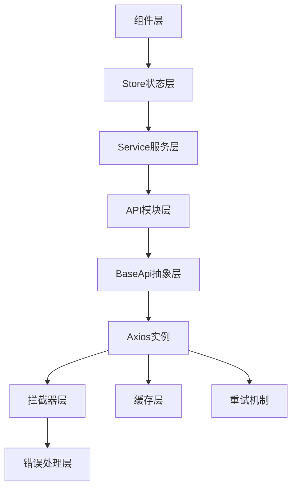

# Vue3项目API通信层架构技术文档

## 概述

本文档详细分析Vue3项目的第四层架构：**API通信层**。API通信层是前后端数据交互的桥梁，负责HTTP请求配置、错误处理、数据转换、缓存管理和接口模块化。本项目基于Axios构建了一套完整的API通信系统，提供类型安全、智能重试、错误处理和缓存机制。

## 技术栈

- **Axios** - HTTP客户端库
- **TypeScript** - 完整的类型安全保障
- **Ant Design Vue** - 错误提示组件
- **环境变量配置** - 灵活的部署配置
- **LRU缓存算法** - 智能的API响应缓存

## 1. API通信架构概览

### 1.1 架构层次结构



### 1.2 核心文件结构

```
src/
├── api/
│   ├── base.ts              # 抽象基础API类
│   ├── index.ts             # API入口文件
│   ├── types.ts             # API类型定义
│   └── modules/             # 业务API模块
│       ├── news/            # 新闻API模块
│       ├── resources/       # 资源API模块
│       └── user.ts          # 用户API模块
├── utils/
│   ├── api.ts               # Axios实例配置
│   ├── interceptors.ts      # 请求/响应拦截器
│   ├── apiErrorHandler.ts   # 统一错误处理
│   └── apiCache.ts          # API缓存管理
├── config/
│   └── index.ts             # 配置管理
└── services/
    └── *.service.ts         # 业务服务层
```

## 2. Axios实例配置与优化

### 2.1 核心实例配置

```typescript
// 创建axios实例
const api = axios.create({
  baseURL:
    API_CONFIG.baseURL || (import.meta.env.DEV ? "" : "http://localhost:3000"),
  timeout: API_CONFIG.timeout,
  headers: {
    "Content-Type": "application/json",
  },
  withCredentials: true, // 允许跨域携带 cookie
});
```

#### 配置特点：

- **环境适配**: 开发环境使用代理，生产环境使用绝对URL
- **超时控制**: 可配置的请求超时时间
- **跨域支持**: 启用credentials携带认证信息
- **标准化**: 统一的Content-Type设置

### 2.2 智能重试机制

```typescript
// 重试配置接口
interface RetryConfig extends AxiosRequestConfig {
  _retry?: boolean;
  _retryCount?: number;
}

// 检查是否需要重试
const shouldRetry = (error: AxiosError): boolean => {
  if (!ERROR_CONFIG.enableRetry) return false;

  const config = error.config as RetryConfig;

  // 如果已经重试了最大次数，不再重试
  if (config._retryCount && config._retryCount >= ERROR_CONFIG.maxRetries) {
    return false;
  }

  // 不重试401（未认证）和403（无权限）错误
  if (error.response?.status === 401 || error.response?.status === 403) {
    return false;
  }

  // 只重试网络错误、超时和5xx错误
  return (
    !error.response ||
    error.code === "ECONNABORTED" ||
    (error.response && error.response.status >= 500)
  );
};

// 响应拦截器：处理错误和重试
api.interceptors.response.use(
  (response) => response,
  async (error: AxiosError) => {
    const config = error.config as RetryConfig;

    if (shouldRetry(error)) {
      config._retryCount = (config._retryCount || 0) + 1;

      // 等待延迟时间 - 指数退避
      const delayTime = ERROR_CONFIG.retryDelay * config._retryCount;
      await new Promise((resolve) => setTimeout(resolve, delayTime));

      // 重试请求
      return api(config);
    }

    return Promise.reject(error);
  }
);
```

#### 重试策略特点：

- **选择性重试**: 只重试网络错误、超时和服务器错误
- **避免无效重试**: 不重试认证和权限错误
- **指数退避**: 重试延迟时间递增
- **最大次数限制**: 防止无限重试
- **配置化控制**: 可通过配置开关重试功能

### 2.3 请求/响应拦截器

```typescript
export const setupInterceptors = (axios: AxiosInstance) => {
  // 请求拦截器
  axios.interceptors.request.use(
    (config) => {
      const store = initStore();
      // 如果有token，添加到请求头
      if (store.token) {
        config.headers.Authorization = `Bearer ${store.token}`;
      }
      return config;
    },
    (error) => {
      return Promise.reject(error);
    }
  );

  // 响应拦截器
  axios.interceptors.response.use(
    (response) => {
      // 转换后端响应格式以匹配前端期望
      if (response.data && response.data.status) {
        // 统一转换 status 为 success 字段
        response.data.success = response.data.status === "success";
      }
      return response;
    },
    (error) => {
      return handleApiError(error);
    }
  );
};
```

#### 拦截器功能：

- **自动认证**: 请求时自动添加Authorization头
- **状态转换**: 后端status字段转换为前端success字段
- **错误统一处理**: 集中的错误处理机制
- **Store集成**: 与Pinia状态管理的无缝集成

## 3. 错误处理系统

### 3.1 自定义API错误类

```typescript
export class ApiError extends Error {
  code: string;
  status: number;
  errors?: Record<string, string[]>;
  details?: unknown;
  timestamp: string;
  path?: string;

  constructor(
    message: string,
    code: string,
    status: number,
    options?: {
      errors?: Record<string, string[]>;
      details?: unknown;
      timestamp?: string;
      path?: string;
    }
  ) {
    super(message);
    this.name = "ApiError";
    this.code = code;
    this.status = status;
    this.errors = options?.errors;
    this.details = options?.details;
    this.timestamp = options?.timestamp || new Date().toISOString();
    this.path = options?.path;

    Object.setPrototypeOf(this, new.target.prototype);
  }

  // 便捷的错误类型判断方法
  isAuthError(): boolean {
    return (
      this.status === STATUS_CODES.UNAUTHORIZED ||
      this.is(ERROR_CODES.AUTH_EXPIRED) ||
      this.is(ERROR_CODES.INVALID_TOKEN)
    );
  }

  isPermissionError(): boolean {
    return (
      this.status === STATUS_CODES.FORBIDDEN ||
      this.is(ERROR_CODES.PERMISSION_DENIED)
    );
  }

  isValidationError(): boolean {
    return (
      this.status === STATUS_CODES.BAD_REQUEST ||
      this.is(ERROR_CODES.VALIDATION_ERROR)
    );
  }
}
```

#### 错误类设计特点：

- **类型化错误**: 标准化的错误信息结构
- **详细上下文**: 包含错误码、状态码、时间戳等
- **验证错误支持**: 支持字段级验证错误
- **便捷判断方法**: 提供语义化的错误类型判断
- **链式调用**: 支持错误类型的链式判断

### 3.2 分层错误处理策略

```typescript
// 主要的错误处理函数
export const handleApiError = async (
  error: AxiosError<ApiErrorResponse>,
  options: ErrorHandlerOptions = {}
): Promise<never> => {
  const {
    showNotification = true,
    redirectOnAuth = true,
    logError: enableLogging = true,
  } = options;

  // 处理响应错误
  if (error.response) {
    const { status, data } = error.response;

    // 构造 API 错误对象
    const apiError = new ApiError(
      data?.message || "请求失败",
      data?.code || ERROR_CODES.SERVER_ERROR,
      status,
      {
        errors: data?.errors,
        details: data?.details,
        timestamp: data?.timestamp || new Date().toISOString(),
        path: error.config?.url,
      }
    );

    // 根据错误类型处理
    if (apiError.isAuthError() && redirectOnAuth) {
      await handleAuthError(apiError);
    } else if (apiError.isPermissionError()) {
      handlePermissionError(apiError);
    } else if (apiError.isValidationError()) {
      handleValidationError(apiError);
    } else if (showNotification) {
      // 其他错误的通用处理
      switch (status) {
        case STATUS_CODES.NOT_FOUND:
          message.error(apiError.message || "请求的资源不存在");
          break;
        case STATUS_CODES.TIMEOUT:
          message.error("请求超时，请稍后重试");
          break;
        case 429: // Too Many Requests
          message.error("请求过于频繁，请稍后重试");
          break;
        default:
          showErrorNotification(apiError);
      }
    }

    return Promise.reject(apiError);
  }

  // 处理网络错误
  if (error.request) {
    const networkError = new ApiError(
      "网络连接失败，请检查您的网络",
      ERROR_CODES.NETWORK_ERROR,
      0
    );
    return Promise.reject(networkError);
  }

  // 处理其他错误
  const unknownError = new ApiError(
    "发生未知错误",
    ERROR_CODES.UNKNOWN_ERROR,
    0
  );
  return Promise.reject(unknownError);
};
```

#### 错误处理层次：

1. **认证错误**: 自动登出并重定向到登录页
2. **权限错误**: 显示权限不足提示
3. **验证错误**: 显示字段级验证错误
4. **网络错误**: 网络连接问题提示
5. **服务器错误**: 详细的错误通知
6. **未知错误**: 通用错误处理

## 4. API模块化设计

### 4.1 抽象基础API类

```typescript
export abstract class BaseApi {
  protected api: AxiosInstance;
  protected baseURL: string;
  protected prefix: string;

  constructor(config: ApiModuleConfig | string = {}) {
    this.api = api;
    if (typeof config === "string") {
      this.baseURL = "";
      this.prefix = config;
    } else {
      this.baseURL = config.baseURL || "";
      this.prefix = config.prefix || "";
    }
  }

  protected getUrl(path: string): string {
    return `/api${this.prefix}${path}`;
  }

  protected async request<T>(
    config: AxiosRequestConfig
  ): Promise<ApiResponse<T>> {
    try {
      const fullUrl = config.url?.startsWith("/api")
        ? config.url
        : this.getUrl(config.url || "");

      console.log("🌐 API 请求:", {
        method: config.method,
        url: fullUrl,
        params: config.params,
        data: config.data,
      });

      const response = await this.api.request<any, any>({
        ...config,
        url: fullUrl,
      });

      return response.data;
    } catch (error) {
      console.error("❌ API 请求失败:", error);
      if (error instanceof Error) {
        return handleApiError(error as AxiosError<ApiErrorResponse>);
      }
      throw error;
    }
  }

  // 标准CRUD方法
  protected async get<T>(
    path: string,
    params?: QueryParams
  ): Promise<ApiResponse<T>> {
    return this.request<T>({ method: "GET", url: path, params });
  }

  protected async post<T>(path: string, data?: any): Promise<ApiResponse<T>> {
    return this.request<T>({ method: "POST", url: path, data });
  }

  protected async put<T>(path: string, data?: any): Promise<ApiResponse<T>> {
    return this.request<T>({ method: "PUT", url: path, data });
  }

  protected async delete(path: string): Promise<ApiResponse<void>> {
    return this.request<void>({ method: "DELETE", url: path });
  }
}
```

#### 基础类设计优势：

- **统一接口**: 所有API模块继承相同的基础方法
- **URL管理**: 自动的URL前缀和路径管理
- **类型安全**: 完整的TypeScript泛型支持
- **错误处理**: 统一的错误处理逻辑
- **调试支持**: 详细的请求/响应日志

### 4.2 具体API模块实现

```typescript
export class NewsApi extends BaseApi {
  constructor() {
    super({ prefix: "/news" });
  }

  // 获取新闻列表
  async getList(params?: NewsQueryParams): Promise<PaginatedResponse<News>> {
    const response = await this.get<News[]>("", params);
    return {
      ...response,
      data: response.data,
      pagination: response.pagination || {
        total: 0,
        page: 1,
        limit: 10,
      },
    };
  }

  // 获取新闻详情
  async getDetail(id: string): Promise<ApiResponse<News>> {
    return await this.get<News>(`/${id}`);
  }

  // 创建新闻
  async create(data: CreateNewsDTO): Promise<ApiResponse<News>> {
    return await this.post<News>("", data);
  }

  // 更新新闻
  async update(id: string, data: UpdateNewsDTO): Promise<ApiResponse<News>> {
    return await this.put<News>(`/${id}`, data);
  }

  // 删除新闻
  async delete(id: string): Promise<ApiResponse<void>> {
    return await this.delete(`/${id}`);
  }

  // 业务特定方法
  async updateStatus(
    id: string,
    status: News["status"]
  ): Promise<ApiResponse<News>> {
    return await this.patch<News>(`/${id}/status`, { status });
  }

  async getCategories(): Promise<ApiResponse<string[]>> {
    return await this.get<string[]>("/categories");
  }
}
```

#### 模块化优势：

- **业务聚合**: 相关API方法集中管理
- **标准CRUD**: 继承基础的增删改查方法
- **业务扩展**: 支持业务特定的API方法
- **类型约束**: 强类型的参数和返回值
- **URL自动管理**: 基于prefix的URL自动拼接

## 5. API缓存系统

### 5.1 LRU缓存算法实现

```typescript
class ApiCache {
  private cache: Map<string, CacheItem<any>>;
  private maxItems: number;
  private totalHits: number;

  constructor() {
    this.cache = new Map();
    this.maxItems = CACHE_CONFIG.maxSize || 100;
    this.totalHits = 0;

    if (CACHE_CONFIG.enabled) {
      this.startCleanupTask();
    }
  }

  get<T>(url: string, params?: Record<string, any>): T | null {
    if (!CACHE_CONFIG.enabled) return null;

    const key = this.generateKey(url, params);
    const item = this.cache.get(key);

    if (!item) return null;
    if (this.isExpired(item)) {
      this.delete(key);
      return null;
    }

    // 更新访问统计
    item.hits++;
    item.lastAccessed = Date.now();
    this.totalHits++;

    return item.data;
  }

  set<T>(
    url: string,
    data: T,
    options?: {
      params?: Record<string, any>;
      ttl?: number;
      tags?: string[];
    }
  ): void {
    if (!CACHE_CONFIG.enabled) return;

    const key = this.generateKey(url, options?.params);

    // 如果缓存已满，清理一些空间
    if (this.cache.size >= this.maxItems) {
      this.evictItems();
    }

    this.cache.set(key, {
      data,
      timestamp: Date.now(),
      ttl: options?.ttl,
      tags: options?.tags,
      hits: 0,
      lastAccessed: Date.now(),
    });
  }

  private evictItems(count = 1): void {
    // 按最后访问时间和点击次数计算优先级，删除优先级最低的项
    const items = Array.from(this.cache.entries())
      .map(([key, item]) => ({
        key,
        priority: item.hits / (Date.now() - item.lastAccessed),
      }))
      .sort((a, b) => a.priority - b.priority);

    for (let i = 0; i < count && i < items.length; i++) {
      this.cache.delete(items[i].key);
    }
  }

  private startCleanupTask(): void {
    // 每分钟执行一次清理
    setInterval(() => this.cleanup(), 60 * 1000);
  }
}
```

#### 缓存系统特点：

- **LRU算法**: 最近最少使用的缓存淘汰策略
- **TTL支持**: 支持单独和全局的过期时间设置
- **标签清理**: 支持按标签批量清除缓存
- **统计信息**: 详细的缓存命中和使用统计
- **自动清理**: 定期清理过期缓存项
- **内存管理**: 限制最大缓存项数量

### 5.2 服务层缓存集成

```typescript
export abstract class BaseService<T> {
  constructor(
    protected endpoint: string,
    protected useCache = true,
    protected defaultCacheOptions: CacheOptions = {}
  ) {}

  protected getCacheKey(key: string, params?: Record<string, any>): string {
    const base = `${this.endpoint}:${key}`;
    return params ? `${base}:${JSON.stringify(params)}` : base;
  }

  protected cacheResponse<R>(
    key: string,
    response: ApiResponse<R>,
    params?: Record<string, any>
  ) {
    if (!this.useCache) return;
    const cacheKey = this.getCacheKey(key, params);
    apiCache.set(cacheKey, response, {
      params,
      tags: [this.endpoint, key],
      ...this.defaultCacheOptions,
    });
  }

  async getAll(params?: QueryParams): Promise<ApiResponse<T[]>> {
    const cacheKey = "list";
    const cached = this.getCached<ApiResponse<T[]>>(cacheKey, params);
    if (cached) return cached;

    const response = await api.get(this.endpoint, { params });
    const apiResponse: ApiResponse<T[]> = {
      success: response.status >= 200 && response.status < 300,
      data: response.data,
    };

    this.cacheResponse(cacheKey, apiResponse, params);
    return apiResponse;
  }
}
```

## 6. 类型安全设计

### 6.1 API响应类型系统

```typescript
// API 响应基础类型
export interface ApiResponse<T = any> {
  success: boolean;
  data: T;
  message?: string;
  total?: number;
  pagination?: {
    total: number;
    page: number;
    limit: number;
  };
}

// 分页响应
export interface PaginatedResponse<T> extends ApiResponse<T[]> {
  pagination: {
    total: number;
    page: number;
    limit: number;
  };
}

// 通用查询参数
export interface QueryParams {
  page?: number;
  limit?: number;
  sortBy?: string;
  sortOrder?: 1 | -1;
  [key: string]: any;
}
```

### 6.2 业务类型定义

```typescript
export interface News {
  id: string;
  title: string;
  content: string;
  summary?: string;
  cover?: string;
  author?: string;
  category?: string;
  tags?: string[];
  publishDate?: string;
  status: "draft" | "published" | "archived";
  viewCount?: number;
  createdAt: string;
  updatedAt: string;
}

export interface CreateNewsDTO extends Partial<News> {
  title: string;
  content: string;
}

export interface UpdateNewsDTO extends Partial<News> {}

export interface NewsQueryParams extends QueryParams {
  category?: string;
  status?: string;
  tag?: string;
  startDate?: string;
  endDate?: string;
}
```

#### 类型设计特点：

- **接口继承**: 基础类型的扩展和复用
- **泛型支持**: 通用类型的参数化
- **可选属性**: 合理的必需和可选字段区分
- **枚举约束**: 状态字段的枚举类型约束
- **扩展性**: 支持业务特定的查询参数

## 7. 配置管理系统

### 7.1 环境变量配置

```typescript
// 环境变量类型声明
interface ImportMetaEnv {
  VITE_APP_TITLE: string;
  VITE_API_BASE_URL: string;
  VITE_API_TIMEOUT: string;
  VITE_CACHE_ENABLED: string;
  VITE_CACHE_TTL: string;
  VITE_APP_DEBUG: string;
  // ... 其他环境变量
}

// API配置
export const API_CONFIG = {
  baseURL: import.meta.env.VITE_API_BASE_URL,
  timeout: Number(import.meta.env.VITE_API_TIMEOUT),
  mock: import.meta.env.VITE_API_MOCK === "true",
  logger: import.meta.env.VITE_ENABLE_LOGGER === "true",
} as const;

// 错误处理配置
export const ERROR_CONFIG = {
  showInConsole:
    APP_CONFIG.debug || import.meta.env.VITE_ENABLE_LOGGER === "true",
  notificationDuration: 4500,
  enableRetry: true,
  maxRetries: 3,
  retryDelay: 1000,
  enableLogging: true,
} as const;
```

### 7.2 状态码和错误码管理

```typescript
// 服务状态码
export const STATUS_CODES = {
  OK: 200,
  CREATED: 201,
  BAD_REQUEST: 400,
  UNAUTHORIZED: 401,
  FORBIDDEN: 403,
  NOT_FOUND: 404,
  SERVER_ERROR: 500,
  // ... 其他状态码
} as const;

// 业务错误码
export const ERROR_CODES = {
  // 通用错误
  UNKNOWN_ERROR: "UNKNOWN_ERROR",
  NETWORK_ERROR: "NETWORK_ERROR",
  SERVER_ERROR: "SERVER_ERROR",

  // 认证相关
  AUTH_EXPIRED: "AUTH_EXPIRED",
  INVALID_TOKEN: "INVALID_TOKEN",

  // 权限相关
  PERMISSION_DENIED: "PERMISSION_DENIED",
  ACCESS_DENIED: "ACCESS_DENIED",

  // 验证相关
  VALIDATION_ERROR: "VALIDATION_ERROR",
  INVALID_PARAMS: "INVALID_PARAMS",
} as const;
```

## 8. API通信最佳实践

### 8.1 请求优化策略

1. **请求去重**: 防止重复请求
2. **请求取消**: 组件卸载时取消请求
3. **批量请求**: 多个请求的批量处理
4. **请求队列**: 控制并发请求数量

### 8.2 错误处理策略

1. **分层处理**: 不同层次的错误处理
2. **用户友好**: 人性化的错误提示
3. **开发友好**: 详细的开发调试信息
4. **错误恢复**: 自动重试和降级策略

### 8.3 性能优化策略

1. **智能缓存**: 基于LRU的缓存策略
2. **请求优化**: 减少不必要的网络请求
3. **数据压缩**: 响应数据的压缩处理
4. **并发控制**: 合理的请求并发管理

### 8.4 安全考虑

1. **认证管理**: 自动的token管理和刷新
2. **CSRF防护**: 跨站请求伪造防护
3. **数据验证**: 前端数据验证和后端验证
4. **敏感信息**: 敏感数据的安全处理

## 9. 扩展建议

### 9.1 功能扩展

1. **请求监控**: API请求的监控和分析
2. **离线支持**: 离线模式下的API处理
3. **GraphQL支持**: GraphQL查询的集成
4. **WebSocket集成**: 实时通信的支持

### 9.2 性能优化

1. **请求预加载**: 智能的数据预加载
2. **虚拟滚动**: 大数据列表的虚拟滚动
3. **CDN优化**: 静态资源的CDN加速
4. **HTTP/2**: HTTP/2的多路复用优化

### 9.3 开发工具

1. **API文档**: 自动生成的API文档
2. **Mock服务**: 开发阶段的Mock数据
3. **调试工具**: API调试和测试工具
4. **性能分析**: API性能的分析工具

## 结论

本项目的API通信层展现了现代前端应用的完整HTTP通信架构：

### 🏗️ 架构优势

1. **类型安全的API**: 完整的TypeScript类型系统
2. **智能错误处理**: 分层的错误处理和恢复机制
3. **高效缓存系统**: LRU算法的智能缓存管理
4. **模块化设计**: 清晰的API模块组织结构
5. **配置化管理**: 灵活的环境配置和参数管理

### 🔧 技术亮点

1. **自动重试机制**: 指数退避的智能重试策略
2. **拦截器系统**: 统一的请求/响应处理
3. **错误类设计**: 面向对象的错误处理
4. **缓存优化**: 基于使用频率的缓存淘汰
5. **调试支持**: 详细的请求日志和错误信息

### 📈 实际价值

这套API通信架构为企业级前端应用提供了：

- **稳定可靠的数据通信**
- **优秀的错误处理体验**
- **高性能的缓存机制**
- **可维护的代码结构**
- **完善的类型安全保障**

是现代Vue3项目API通信层的优秀实践案例，为复杂前端应用的数据交互提供了完整的解决方案。

---

_文档创建时间: 2025年6月16日_  
_技术版本: Vue 3.x + Axios + TypeScript_
