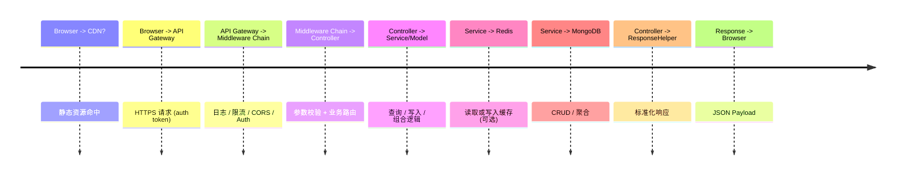

# 系统架构总览

本文件提供后端 CMS 的宏观视角（领域边界 / 交互关系 / 运行时拓扑），用于快速理解系统组成。详细模块字段与 API 逻辑请见 `backend-modules.md`。

## 🎯 设计目标

- 统一内容治理（新闻 / 资源 / 活动）
- 可观测与可审计（操作日志、活动追踪）
- 安全与权限边界清晰（RBAC + 中台型扩展）
- 逐步演进能力（支持后续拆分服务 / 接入缓存 / 搜索）

## 🧱 核心构件

| 层次       | 角色               | 说明                                 |
| ---------- | ------------------ | ------------------------------------ |
| API 接入层 | Express 应用       | REST 接口路由编排 / 中间件链         |
| 领域模型层 | Mongoose Models    | 统一数据访问与约束（Schema + 索引）  |
| 业务服务层 | 控制器 + 服务      | 聚合业务规则（缓存、批量、权限校验） |
| 基础设施层 | Mongo / Redis      | 持久化 + 缓存 + 会话/限流支持        |
| 跨领域支持 | 日志 / 鉴权 / 监控 | 统一观测与安全策略                   |

## 🔗 模块分区（Domain Boundaries）

- Content: News / Resource / Category / Attachment Pipeline
- User & Access: User / Role / Permission / Auth
- Interaction: Comment / Favorite / ViewHistory / Share
- Operations: Activity / ActivityLog / Dashboard Metrics
- Configuration: SiteSetting (分组设置 + 缓存 + 版本追踪)

## 🛣️ 典型请求路径

## 🧩 中间件链 (简化)

顺序示例：

1. 安全头 / CORS
2. 请求日志（结构化）
3. 速率限制（跳过健康检查）
4. JWT 解析（可选）
5. 权限检查（需要 auth 的路由）
6. 控制器逻辑
7. 统一错误处理器

## 🗃️ 数据存储策略

| 领域            | 存储       | 缓存策略                      | 备注               |
| --------------- | ---------- | ----------------------------- | ------------------ |
| News / Resource | Mongo 集合 | 热点列表 / 分类缓存           | 支持分页 + 索引    |
| SiteSetting     | Mongo      | Redis (key=sitesetting:group) | 更新后广播失效     |
| Activity / Logs | Mongo      | 暂无                          | 可迁移至专用审计库 |
| Interaction     | Mongo      | 未来可引入计数缓存            | 浏览量 / 收藏聚合  |

## 🛡️ 安全与权限骨架

- 鉴权：JWT（短期）+ 刷新机制（规划中）
- 权限：基于角色 + 资源/操作 (module:action) 粒度检查
- 速率限制：按 IP / 路由段（健康检查豁免）
- 输入防护：Schema 级约束 + 控制器层白名单提取
- 后续待补：CSP / Helmet 强化 / API Key 机制

## 🔍 可观测性

| 维度 | 现状             | 规划                          |
| ---- | ---------------- | ----------------------------- |
| 日志 | 文件/控制台      | 结构化 JSON + 收集管道        |
| 指标 | 暂缺             | 接入 Prometheus Exporter      |
| 追踪 | 暂缺             | OpenTelemetry 接入 (Batch 3+) |
| 异常 | try/catch + 输出 | 集成 Sentry / 报警渠道        |

## 🚀 扩展演进路径

阶段化里程碑：

1. (Now) 单体稳定 + 缓存优化点状使用
2. (Next) 引入集中日志与指标，统一ENV校验
3. (Later) 抽离重读业务为独立服务（搜索 / 推荐）
4. (Future) 接入队列（事件驱动：统计 / 通知）

## 🧪 测试策略对接

- 单元：模型校验 / 控制器纯逻辑
- 集成：路由层 + 权限路径 + 缓存失效
- 端到端：核心用户场景（新闻发布 / 资源上传 / 设置修改）

## 📌 读取指引

想了解具体字段与接口 → 查看 `backend-modules.md`
想了解环境变量 → `../environment-variables.md`
想了解测试策略 → `../quality/testing-strategy.md` (生成后)

---

_本文件为高层视角；保持≤ 400 行，定期同步重大变更。_
