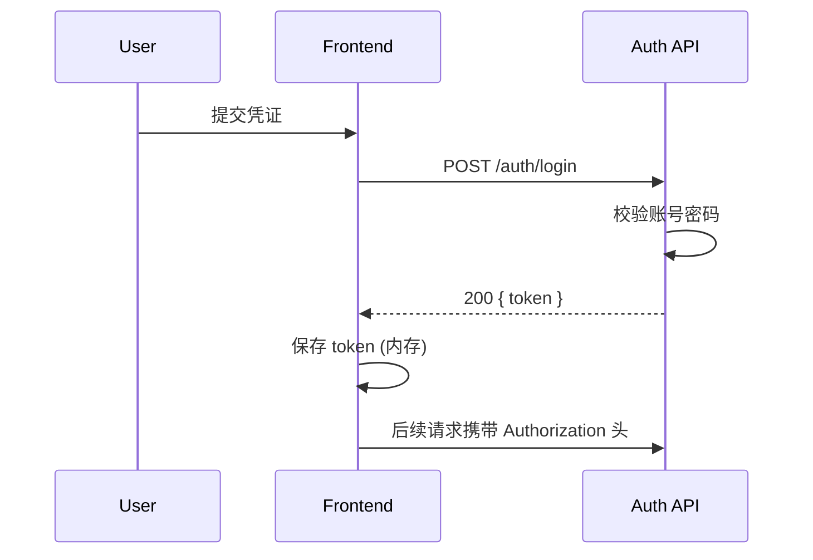

# 认证与会话策略

本文件描述身份认证、令牌结构、刷新策略与后续演进计划。权限模型参见 `rbac-model.md`。

## 🎯 设计原则

- 无状态优先：使用 JWT 承载身份与必要声明
- 可扩展：支持未来多终端 / 多因子扩展
- 最小暴露：客户端仅持访问所需最小信息
- Fail‑Fast：关键环境变量缺失直接拒绝启动

## 🔑 当前方案 (Phase 0/1)

| 项       | 内容                                             |
| -------- | ------------------------------------------------ |
| 令牌类型 | 单一 Access Token (短期)                         |
| 签名算法 | HS256 (共享密钥)                                 |
| 载荷建议 | `sub` (用户ID), `role`, `iat`, `exp`             |
| 过期时间 | 2h (建议)                                        |
| 刷新机制 | 暂无（后续 Phase 引入 Refresh Token）            |
| 传输方式 | `Authorization: Bearer <token>`                  |
| 存储位置 | 浏览器内存 / Pinia（避免 localStorage 长期驻留） |

## 🧱 载荷最小化示例

```json
{
  "sub": "64f1c...",
  "role": "editor",
  "iat": 1695980000,
  "exp": 1695987200
}
```

> 避免放入邮箱 / 权限全集等冗余信息；权限实时查询或缓存。

## 🛂 登录流程（短期）



## 🔄 刷新机制（规划 Phase 2）

| 项            | 描述                                    |
| ------------- | --------------------------------------- |
| Refresh Token | 长期（7d-14d），仅服务器可失效列表校验  |
| 轮换策略      | 每次刷新颁发新的 RT，旧的加入黑名单窗口 |
| 存储方式      | HttpOnly + Secure Cookie                |
| 撤销          | 主动登出 / 风险检测触发                 |

## 🧪 校验逻辑

| 步骤 | 校验            | 失败处理            |
| ---- | --------------- | ------------------- |
| 解析 | 结构 / Base64   | 401 invalid token   |
| 签名 | HS256 + secret  | 401 signature error |
| 过期 | `exp < now`     | 401 token expired   |
| 角色 | role 存在且合法 | 403 invalid role    |

## 🧪 示例校验代码片段

```js
import jwt from "jsonwebtoken";

export function verifyToken(token) {
  try {
    const payload = jwt.verify(token, process.env.JWT_SECRET, {
      algorithms: ["HS256"],
    });
    return { valid: true, payload };
  } catch (err) {
    return { valid: false, reason: err.name };
  }
}
```

## 🛡️ 防护要点

| 风险       | 对策                                  |
| ---------- | ------------------------------------- |
| Token 窃取 | 短期 + 最小权限 + 检测异常活动        |
| 重放攻击   | 令牌短期 + 列出高风险操作日志审计     |
| XSS 窃取   | 不落地 localStorage / 加强 CSP (规划) |
| 暴力破解   | 登录限速 + 失败计数锁定               |
| 密钥泄露   | 定期滚动 + 最长 90 天轮换窗口         |

## 🔍 日志与审计

| 事件          | 内容                          | 级别 |
| ------------- | ----------------------------- | ---- |
| login.success | userId / ip / ua              | info |
| login.failed  | username / ip / reason        | warn |
| token.invalid | ip / token 截断(前8) / reason | warn |
| token.expired | userId / exp                  | info |
| logout        | userId / reason               | info |

## 🚦 演进路线参考

| Phase | 能力                 | 说明                     |
| ----- | -------------------- | ------------------------ |
| 1     | 单一 Access Token    | 当前实施                 |
| 2     | Refresh Token + 旋转 | HttpOnly Cookie + 黑名单 |
| 3     | 多密钥支持 (kid)     | 滚动密钥平滑过渡         |
| 4     | MFA / OTP            | 高风险操作二次验证       |
| 5     | API Key / 机器身份   | 服务端对服务端调用       |

## 🔐 多密钥轮换草案 (Phase 3)

| 项       | 描述                      |
| -------- | ------------------------- | --------------------- |
| 环境变量 | JWT_SECRETS=key_v2,key_v1 | 按顺序尝试验签        |
| Header   | kid 用于快速定位          | 旧 Token 过渡期内有效 |
| 过渡期   | 7-14 天                   | 超期强制重新登录      |

## 🧩 Open Issues (待定决策)

| 主题         | 说明                       | 影响         |
| ------------ | -------------------------- | ------------ |
| 角色缓存策略 | 是否在 Token 内附带 roles? | 权限实时性   |
| 租户扩展     | 是否加 tenantId 声明       | 数据隔离设计 |
| 风险拦截     | 是否接入行为风控           | 安全成熟度   |

---

更新本文件时需同步：

1. `rbac-model.md` 角色矩阵变更
2. Login / Refresh API 约定（openapi 文档）
3. 客户端 token 持久化策略说明
